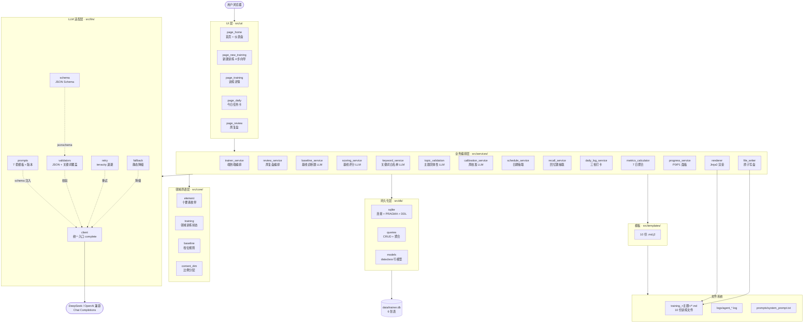
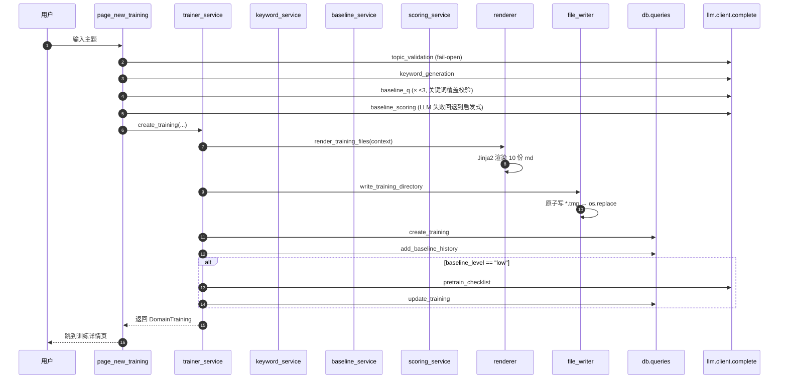
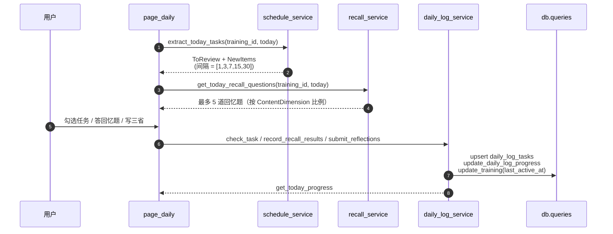
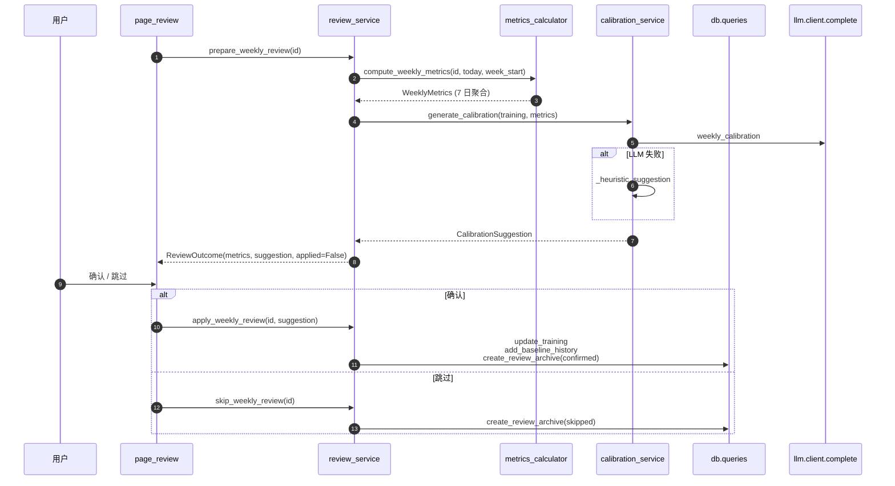
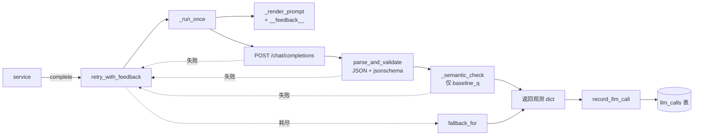

# 🏗 训练教练 MVP · 架构

> 项目仓库地图总览：[codemap.md](../codemap.md)
> 子目录地图：[src/](../src/codemap.md) · [src/core/](../src/core/codemap.md) · [src/db/](../src/db/codemap.md) · [src/llm/](../src/llm/codemap.md) · [src/services/](../src/services/codemap.md) · [src/ui/](../src/ui/codemap.md) · [src/cli/](../src/cli/codemap.md)

---

## 1. 项目上下文

**项目定位**：基于"训练之道·十要素完整闭环 v3"的自用训练教练应用。把训练理论（十要素、学习本质）落地成可执行的本地网页应用，支持"新建训练 → 日常执行 → 周复盘校准"完整闭环。所有 LLM 调用可追溯、所有训练文件可落盘。

**理论根基**：核心理论是《训练之道·十要素完整闭环 v3》与《学习的本质》。十要素把"训练一个技能"拆成可执行、可观测、可校准的闭环；学习本质回答"为什么这么拆"。

**目标用户**：MVP 阶段只有用户本人（自用）。本期 MVP 仅覆盖"人"训练对象，LLM 与动物训练分支不在范围内。

**MVP 状态**（来自 README）：✅ Phase 1 已完成。Phase 2（通用化）计划中。

---

## 2. 分层架构图（Mermaid）



**关键约束**：
- UI 层只调 `services/*` 的入口，**不直接调 LLM、不直接连 DB**。
- `services/*` 里 14 个服务按"编排层 vs 子服务"分两批：编排层（`trainer_service` / `review_service`）串联多个子服务完成端到端业务；子服务分两类：① LLM 适配（`baseline_service` / `scoring_service` / `keyword_service` / `topic_validation` / `calibration_service`）；② 纯计算/数据视图（`schedule_service` / `recall_service` / `daily_log_service` / `metrics_calculator` / `progress_service` / `renderer` / `file_writer`）。
- `core/*` 是纯模块（无 IO），提供枚举、数据类、纯函数。
- `llm/` 暴露唯一入口 `client.complete()`；其他模块**禁止**直接 `requests.post(...)`。

---

## 3. 关键业务流程图

### 3.1 新建训练（对应 `page_new_training` 4 步到 `trainer_service.create_training`）



### 3.2 每日任务卡（page_daily）



### 3.3 周复盘（page_review → review_service）



### 3.4 LLM 调用（统一入口 → 重试 → 降级 → 入库）



---

## 4. 模块边界

| 模块 | 路径 | 职责 | 说明 |
|---|---|---|---|
| `src/main.py` | 入口 | 按 `?page=` 把请求分派给 5 个 `render()` | Streamlit 单进程，无 `st.navigation` |
| `src/config.py` | 配置 | 路径常量 + `.env` 加载 + `load_system_prompt()` | 老式全局常量风格 |
| `src/logger.py` | 日志 | Rich Panel + 文件落盘的 `AgentLogger` | 早期路径，当前主要服务层未使用 |
| `src/cli/__main__.py` | CLI | `argparse` + `init-db` 子命令 | **只有 1 个子命令**（`init-db`），无 `seed` |
| `src/core/element.py` | 原语 | `Element` / `TrainingStatus` / `BaselineLevel` 枚举 | 纯枚举 |
| `src/core/baseline.py` | 原语 | `BaselineScore` / `compute_level` / `score_delta_to_level` / `merge_baseline_history` | 纯函数 |
| `src/core/training.py` | 原语 | `Training` 领域状态 dataclass | 含 `needs_weekly_review` 等派生判断 |
| `src/core/content_dim.py` | 原语 | `ContentDimension` + `DEFAULT_DAILY_RATIO` + `distribute_by_ratio` | 最大余数法 |
| `src/services/trainer_service.py` | 编排 | 新建训练端到端 | 串联 5 个 LLM 子服务 + 渲染 + 落盘 + 入库 |
| `src/services/review_service.py` | 编排 | 周复盘端到端 | 串联 metrics + calibration + 归档 |
| `src/services/baseline_service.py` | LLM 子服务 | 3 道基线诊断题 | 最多 3 次重试 + 关键词覆盖校验 + fallback |
| `src/services/scoring_service.py` | LLM 子服务 | 基线评分 | 失败回退到 `_heuristic_score` |
| `src/services/keyword_service.py` | LLM 子服务 | 关键词白名单 | 失败回退到 `topic.split()[0]` |
| `src/services/topic_validation.py` | LLM 子服务 | 主题具体性 | **fail-open**（LLM 不可用不阻塞） |
| `src/services/calibration_service.py` | LLM 子服务 | 周校准建议 | `baseline_score_delta` 钳位 ±0.5 |
| `src/services/schedule_service.py` | 视图 | 抽取今日任务 | `STANDARD_INTERVALS=[1,3,7,15,30]` |
| `src/services/recall_service.py` | 视图 | 抽取今日回忆题 | 最多 5 题，按维度轮询 |
| `src/services/daily_log_service.py` | 写 | 任务勾选 / 三省 / 回忆题 / 今日进度 | `record_recall_results` 是**累加** |
| `src/services/metrics_calculator.py` | 计算 | 7 日周指标聚合 | 纯 SQL，可单测 |
| `src/services/progress_service.py` | 视图 | `TrainingProgress` / `HomeDashboard` / `P1Summary` | 只读 |
| `src/services/renderer.py` | 渲染 | Jinja2 渲染 10 份 md | 纯函数，无 IO |
| `src/services/file_writer.py` | 落盘 | 目录安全命名 + 原子写盘 | 0o755/0o644，`.tmp` → `os.replace` |
| `src/llm/client.py` | LLM 入口 | `complete(prompt_name, variables, schema, max_attempts)` | 项目内**唯一** HTTP 调用 |
| `src/llm/prompts.py` | LLM | `PROMPT_REGISTRY` + 7 套模板常量 | 含版本号 |
| `src/llm/schema.py` | LLM | `SCHEMA_REGISTRY` + 7 个 JSON Schema | Draft 2020-12 |
| `src/llm/validators.py` | LLM | `parse_and_validate` + `keyword_coverage_check` | |
| `src/llm/retry.py` | LLM | tenacity 指数退避 | `wait_exponential(1,1,10)` |
| `src/llm/fallback.py` | LLM | `fallback_for(prompt_name)` | 仅 `baseline_q` 有静态降级 |
| `src/db/sqlite.py` | DB | `get_connection` + `init_db` + Wal/外键 PRAGMA | 唯一连接入口 |
| `src/db/queries.py` | DB | 全部 CRUD + 聚合 + JSON 字段编解码 | 列白名单 + 状态枚举校验 |
| `src/db/models.py` | DB | `RowModel` 基类 + 6 个 `@dataclass` 行模型 + `Element` 枚举 | **不是 Pydantic**，是 dataclass |
| `src/templates/*.md.j2` | 模板 | 10 份 Jinja2 模板 | `00_对象档案.md.j2` … `09_边界与止.md.j2` |
| `src/ui/page_*.py` | 视图 | 5 个 Streamlit 页面 | 只调 `services/*` + 少量 `db/queries` 入口 |

**已废弃 / 早期路径（保留作参照，不应再依赖）**：

| 文件 | 状态 | 备注 |
|---|---|---|
| `src/storage.py` | 早期 | 自带 `_init_db()` 建 `sessions` / `baselines` 两表，**已被 `src/db/sqlite.py` 取代** |
| `src/diagnoser.py` | 早期 | 关键词路由 + 规则评分的诊断器，被 `baseline_service` + `scoring_service` 取代 |
| `src/generator.py` | 早期 | Python f-string 拼 5 份 md，被 `renderer` + 10 份 Jinja2 模板取代 |
| `src/models.py` | 部分 | 4 个 Pydantic 模型（`UserProfile` / `DiagnosisQuestion` / `BaselineResult` / `TrainingSession`）早期路径的数据契约；当前主要服务层用 `src.core` dataclass + `src/db.models` |
| `src/logger.py` | 早期 | ReAct 风格 `AgentLogger`；当前主要服务层未使用 |

---

## 5. 数据存储

### 5.1 SQLite 库：`data/trainer.db`

DDL 在 [`src/db/tables.sql`](../src/db/tables.sql)。6 张表 + 4 个索引：

| 表 | 用途 | 关键字段 |
|---|---|---|
| `trainings` | 训练主题元数据 | `topic`, `status ∈ {created, active, paused, archived, failed}`, `keywords` (JSON), `must_cover_count`, `forbidden` (JSON), `directory`, `baseline_score`, `baseline_level ∈ {high, mid, low}`, `targets` (JSON), `review_items` (JSON), `pretrain_checklist` (JSON), `schedule` (JSON), `materials` (JSON), `current_week`, `last_review_at`, `created_at`, `last_active_at` |
| `daily_logs` | 每日三省打卡 | `training_id` FK, `log_date`, `total_tasks`, `completed_count`, `recall_questions_total/correct`, `recall_success_rate`, `three_reflections` (JSON), `reflection_submitted_at`；UNIQUE(`training_id`,`log_date`) |
| `baseline_history` | 基线评分轨迹 | `training_id` FK, `baseline_score`, `dimension_scores` (JSON), `recorded_at` |
| `llm_calls` | LLM 调用审计 | `training_id` FK (可空), `call_purpose ∈ {topic_validation, keyword_generation, baseline_q, baseline_scoring, weekly_calibration, md_generation, pretrain_checklist}`, `prompt_name`, `prompt_version`, `model`, `input_text`, `output_text`, `output_json` (JSON), `validation_result`, `retry_count`, `latency_ms`, `tokens_in`, `tokens_out`, `failure_reason`, `fallback_used` |
| `review_archives` | 周复盘归档 | `training_id` FK, `week_start`, `metrics` (JSON), `llm_suggestions` (JSON), `user_action ∈ {confirmed, skipped}` |
| `daily_log_tasks` | 任务卡条目 | `daily_log_id` FK, `task_type ∈ {review, new, recall}`, `task_ref`, `completed`, `completed_at`, `is_required` |

外键约束：`PRAGMA foreign_keys = ON` 必须开启（`src/db/sqlite.py` 已默认开启）。

索引：`idx_trainings_last_active_at`, `idx_daily_logs_training_date`, `idx_baseline_history_training`, `idx_llm_calls_purpose`, `idx_llm_calls_prompt_version`, `idx_review_archives_training_week`。

### 5.2 文件系统产物

| 路径 | 写入方 | 内容 |
|---|---|---|
| `workspace/training_<slug>/00_对象档案.md … 09_边界与止.md` | `trainer_service` → `renderer` + `file_writer` | 10 份训练文件 |
| `logs/agent_<session_id>.log` | `src/logger.AgentLogger` | 早期路径日志 |
| `prompts/system_prompt.txt` | `src/config.load_system_prompt` | 首次启动写入默认中文 prompt |

> `data/trainer.db` 与 `.env` **不入 git**（见 `.gitignore`）。

---

## 6. LLM 调用契约

`src/llm/client.complete(prompt_name, variables, schema=None, max_attempts=3)` 返回：

```python
{
  "output_text":   str,          # 原始模型文本（fallback 时为 json.dumps(fb)）
  "output_json":   dict | None,  # 解析并校验通过的对象
  "latency_ms":    int,
  "tokens_in":     int,
  "tokens_out":    int,
  "retry_count":   int,          # 实际额外重试次数
  "model":         str,          # DEEPSEEK_MODEL
  "prompt_name":   str,
  "prompt_version": str,         # 来自 PROMPT_REGISTRY，便于回溯
}
```

7 套 prompt 模板（在 `src/llm/prompts.py`）对应 7 类 `call_purpose`：

| `prompt_name` | `call_purpose` | 调用方 |
|---|---|---|
| `topic_validation` | `topic_validation` | `topic_validation.validate_topic` |
| `keyword_generation` | `keyword_generation` | `keyword_service.generate_keywords` |
| `baseline_q` | `baseline_q` | `baseline_service.generate_baseline_questions` |
| `baseline_scoring` | `baseline_scoring` | `scoring_service.score_baseline` |
| `weekly_calibration` | `weekly_calibration` | `calibration_service.generate_calibration` |
| `md_generation` | `md_generation` | `trainer_service`（当前实际走 Jinja2，但 prompt 保留） |
| `pretrain_checklist` | `pretrain_checklist` | `trainer_service._generate_pretrain_checklist` |

JSON Schema 校验（`jsonschema` Draft 2020-12）+ 关键词覆盖率校验（仅 `baseline_q`）。

降级：`fallback_for(prompt_name)`，**目前仅 `baseline_q` 定义了静态降级载荷**（3 道硬编码诊断题）；其他 purpose 失败时由调用方 service 自行处理（`topic_validation` fail-open，其他走启发式）。

---

## 7. 关键设计决策

### 1. JSON Schema 强约束 vs Markdown 落盘
LLM 输出用 JSON Schema 强约束（机器可校验、可入库）；用户看的内容由 Jinja2 渲染 10 份 md 模板生成（人类可读、可分享）。**JSON 是契约，md 是产出**。

### 2. 关键词白名单 = LLM 自生成 + 覆盖率校验
领域灵活性靠 LLM，质量稳定性靠覆盖率强制（关键词必须出现在诊断题中）。覆盖不足有 `keyword_service` 兜底（`topic.split()[0]` 作为唯一种子）。

### 3. 固定间隔 1-3-7-15-30（MVP）
实现简单可靠，先验证闭环跑通；位于 `src/services/schedule_service.py` 的 `STANDARD_INTERVALS` 常量。Phase 2 计划改为基于回忆成功率动态调整。

### 4. 周复盘 = 机械计算 + LLM 裁决双层
机械能算的（坚持天数、完成率、回忆正确率）不让 LLM 算 — 节省 token、稳定。需要判断的（基线升多少、要不要降级）让 LLM 裁决。

### 5. LLM 调用可观测层必含 `prompt_version`
每次调用都写入 `llm_calls` 表（`prompt_name` / `prompt_version` / `latency_ms` / `tokens_in` / `tokens_out` / `validation_result` / `retry_count` / `fallback_used`）。是 Phase 3 Harness 化（A/B 实验、回归测试、成本分析）的基建。

### 6. UI 不直访 DB / LLM
UI 层只调用 `services/*` 暴露的入口；个别页面（`page_training` / `page_daily` / `page_review`）在 `_render_no_training` 里直读 `db/queries` 拉训练列表，但不写。所有 LLM 调用都封装在 `src/llm/` 内。

### 7. fail-open vs 失败兜底
只有 `topic_validation` 对 LLM 失败采用 **fail-open**（不阻塞用户流程）；其他 7 个 LLM 调用点都用 `fallback_for` / 启发式回退，宁可降级不出错。

---

## 8. 新人阅读顺序

1. **理论根基**（先看为什么）：[docs/training_ten_elements.md](training_ten_elements.md) + [docs/学习的本质.md](学习的本质.md)。
2. **仓库地图**（总览）：[codemap.md](../codemap.md) — 5 分钟看完目录职责与端到端流程。
3. **本架构文档**（精读本文件）：分层图 + 关键流程 + 模块边界 + 表结构。
4. **子目录地图**（按需精读）：[src/](../src/codemap.md) · [src/core/](../src/core/codemap.md) · [src/db/](../src/db/codemap.md) · [src/llm/](../src/llm/codemap.md) · [src/services/](../src/services/codemap.md) · [src/ui/](../src/ui/codemap.md) · [src/cli/](../src/cli/codemap.md)。
5. **走通闭环**：`uv run python scripts/e2e_full_flow.py` — 看真实数据如何在 6 张表 + 10 份 md 之间流转。

---

## 9. 演进方向

- **Phase 2 · 通用化**：多用户、权限、对象扩展（人 / LLM / 动物）。SQLite 单点写并发问题在 Phase 2 评估切换 PostgreSQL。
- **Phase 3 · Harness 化**：A/B 实验框架、回归测试套件、prompt 版本管理 UI、自动评估指标（回忆正确率、基线升级速度）。本期 MVP 的 `llm_calls` 表就是这一阶段的基建。
- **Phase 4 · 数据飞轮**：真实使用数据回流 → 策略调优 → 模板迭代。基于 `llm_calls` 与 `daily_logs` 的大样本统计，找到"什么样的主题具体性校验问题能筛掉烂主题"、"什么样的回忆题间隔最稳"。
