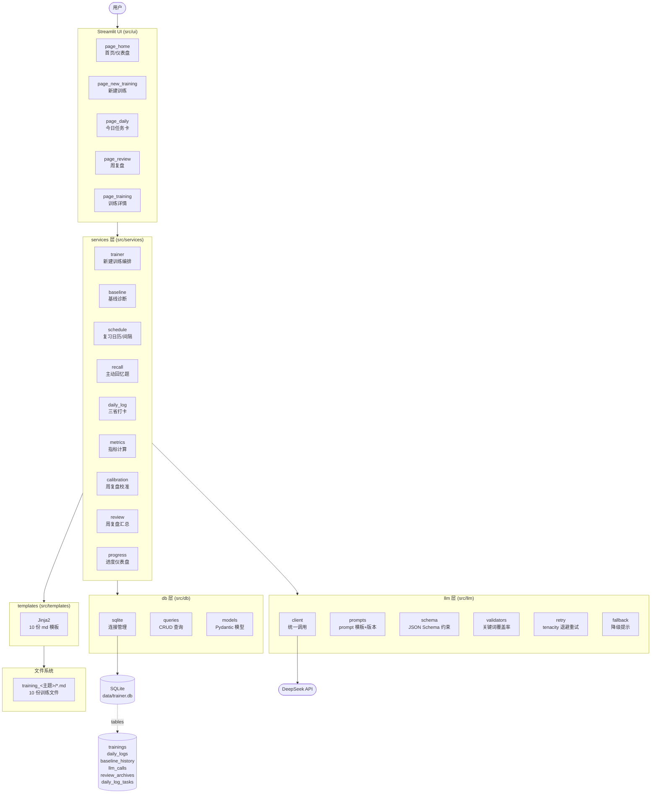

# 🏗 训练教练 MVP · 架构

> 对应 OpenSpec change: `trainer-mvp-v1`

---

## 项目上下文

**项目定位**：基于「训练之道·十要素完整闭环 v3」的自用训练教练应用。把训练理论（十要素、学习本质）落地成可执行的本地网页应用，支持"新建训练 → 日常执行 → 周复盘校准"完整闭环。所有 LLM 调用可追溯、所有训练文件可落盘。

**理论根基**：核心理论是《训练之道·十要素完整闭环 v3》与《学习的本质》。十要素把"训练一个技能"拆成可执行、可观测、可校准的闭环；学习本质回答"为什么这么拆"。LLM 训练场景的工程能力说明见 [minimax-v3-SKILL.md](../docs/minimax-v3-SKILL.md)。

**目标用户**：MVP 阶段只有用户本人（自用）。Phase 2 拓展到朋友/试用者，远期面向 GitHub 开源用户（作为面试项目展示）。本次 MVP 仅覆盖「人」训练对象，LLM 与动物训练分支不在范围内。

---

## 系统架构图

---

## 模块边界

| 模块 | 路径 | 职责 |
|---|---|---|
| `src/main.py` | 入口 | Streamlit 多 Page 路由 |
| `src/config.py` | 配置 | 读 `.env`，导出全局配置对象 |
| `src/logger.py` | 日志 | 统一日志格式与级别 |
| `src/cli/` | CLI | `init-db`、`seed` 等命令 |
| `src/core/` | 核心 | 业务常量、间隔算法、档位规则 |
| `src/services/` | 业务编排 | trainer / baseline / schedule / recall / daily_log / metrics / calibration / review / progress |
| `src/llm/` | LLM 客户端 | client / prompts / schema / validators / retry / fallback |
| `src/db/` | 持久化 | sqlite 连接 / queries / models |
| `src/ui/` | Streamlit Pages | page_home / page_new_training / page_daily / page_review / page_training |
| `src/templates/` | Jinja2 模板 | 10 份 md 文件的渲染模板 |
| `data/trainer.db` | 存储 | SQLite 数据库（不入 git） |
| `training_<主题>/` | 落盘 | 每主题一个目录，10 份 md |

---

## LLM 调用契约

所有 LLM 调用走 `src/llm/` 统一入口，返回 **JSON Schema 强约束** 的结构化结果（决策 5）。入库到 `llm_calls` 表的必填字段：

| 字段 | 类型 | 说明 |
|---|---|---|
| `call_purpose` | string | 调用目的枚举：`baseline_question` / `keyword_extract` / `recall_question` / `calibration_judge` / ... |
| `prompt_name` | string | prompt 模板名（如 `baseline_v1`） |
| `prompt_version` | string | semver 版本号，用于 A/B 与回归 |
| `model` | string | 实际调用的模型名 |
| `latency_ms` | int | 端到端耗时 |
| `tokens_in` / `tokens_out` | int | token 用量 |
| `input` / `output` | text | 入参与出参原文 |
| `validation_result` | json | Schema 校验结果 + 关键词覆盖率 |
| `retry_count` | int | 重试次数 |

JSON 是机器看的契约，进度仪表盘的数据来源是 SQLite（机械计算），md 文件经 Jinja2 模板渲染生成 —— **JSON 不影响用户看到的进度**。

---

## 数据库 schema 概要

| 表 | 用途 |
|---|---|
| `trainings` | 训练主题元数据（主题、状态、关键词白名单、基线档位、当前间隔天数） |
| `daily_logs` | 每日三省打卡记录（忠于目标/方法有效/付诸实践） |
| `baseline_history` | 基线评分历史轨迹，用于升级曲线 |
| `llm_calls` | 所有 LLM 调用的可观测记录（prompt_version / latency / tokens / validation） |
| `review_archives` | 周复盘归档（指标快照 + LLM 裁决的校准建议） |
| `daily_log_tasks` | 今日任务卡的具体任务项（来自复习日历 + 回忆题） |

---

## 关键设计决策

### 1. JSON Schema 强约束 vs Markdown 落盘
LLM 输出用 JSON Schema 强约束（机器可校验、可入库）；用户看的内容由 Jinja2 渲染 md 模板生成（人类可读、可分享）。**JSON 是契约，md 是产出**。

### 2. 关键词白名单 = LLM 自生成 + 覆盖率校验
领域灵活性靠 LLM，质量稳定性靠覆盖率强制（关键词必须出现在诊断题/回忆题中）。覆盖窄的主题有 fallback 词典兜底。

### 3. 固定间隔 1-3-7-15-30（MVP）
实现简单可靠，先验证闭环跑通；Phase 2 改为基于回忆成功率动态调整。

### 4. 周复盘 = 机械计算 + LLM 裁决双层
机械能算的（坚持天数、完成率、回忆正确率）不让 LLM 算 —— 节省 token、稳定。需要判断的（基线升多少、要不要降级）让 LLM 裁决。

### 5. LLM 调用可观测层必含 prompt_version
是 harness 化的伏笔：A/B 实验、回归测试、成本分析、prompt 调优全依赖这一层。

---

## 演进方向

**Phase 2 · 通用化**：多用户、权限系统、对象扩展（人/LLM/动物）。DB schema 已预留 `is_active` 字段，多训练主题并行。SQLite 单点写并发问题在 Phase 2 评估切换 PostgreSQL。

**Phase 3 · Harness 化**：A/B 实验框架、回归测试套件、prompt 版本管理 UI、自动评估指标（回忆正确率、基线升级速度）。本期 MVP 的 `llm_calls` 表就是这一阶段的基建。

**Phase 4 · 数据飞轮**：真实使用数据回流 → 策略调优 → 模板迭代。基于 `llm_calls` 与 `daily_logs` 的大样本统计，找到"什么样的主题具体性校验问题能筛掉烂主题"、"什么样的回忆题间隔最稳"。