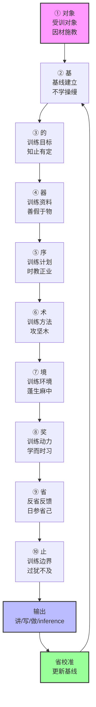
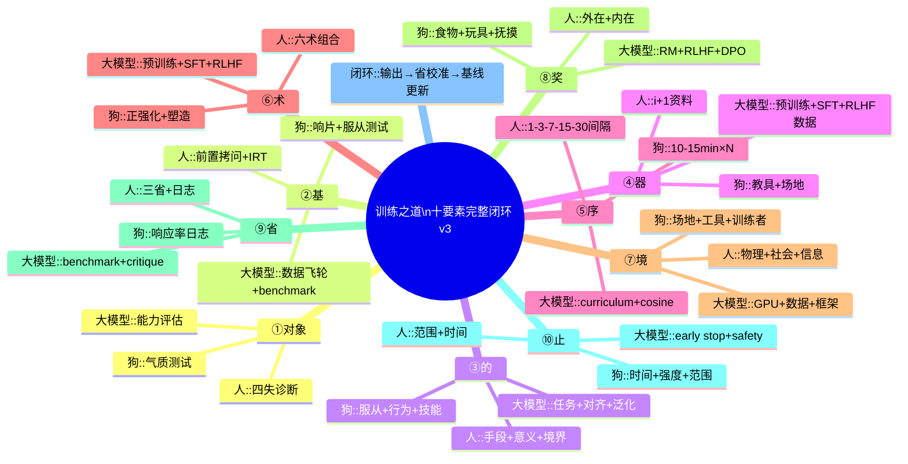

# 训练之道：十要素完整逻辑闭环（重构补全版 v3）

> **核心升级**：在原九要素（基、器、序、的、术、省、境、对象、止）基础上，新增**奖**（奖励机制/动力源），形成十要素完整闭环。本版将原"对象放在中间"的并列式结构，重构为**以对象为主线、贯穿始终的"对象→基→的→器→序→术→境→奖→省→止"实操流程**。同时把"环境（境）"按人/大模型/动物三类对象分别细化，让每条要素都"对象化、可执行、可验证"。

**persona 声明**：本文以荀子《劝学》《正名》《礼记·学记》为经，认知科学（间隔效应、提取强化、元认知、自我决定理论）为纬，机器学习（预训练/微调/RLHF/奖励建模）、动物行为学（操作性条件反射、行为塑造）为辅，构建"训练"底层算法。训练不是书斋诵读或健身房重复，而是智能体通过结构化干预实现质变的通用协议。**训练的终极评判标准不是"知道多少"，而是"在没有外部强化时仍能稳定输出目标行为"——这需要把"动力（奖）"内化为系统自身的一部分。**

---

## 一、为什么必须重排要素？——从"中段工序"到"对象主导全流程"

### 1.1 原九要素的局限

原九要素的逻辑是"先做基检查，再走器→序→的→术→省→境→对象→止，最后省更新基"。**但这一流程隐含一个 bug：把"对象"放在第 7 步，好像它是中途插入的变量。**

实际上，**对象决定了所有其他要素的具体形态**：

- 对**人**，"基"是认知基线（知识面×深度×量），"奖"是内在动机+外在认可，"境"是师友社群。
- 对**大模型**，"基"是预训练数据质量 + 已有能力，"奖"是 reward model 的标量信号，"境"是 GPU 集群 + 分布式训练框架。
- 对**狗**，"基"是已建立的条件反射程度，"奖"是食物/玩具/抚摸，"境"是训练场地 + 干扰物控制。

如果不先确定对象，**"基"无从测、"的"无从定、"器"无从选、"术"无从配、"境"无从设、"奖"无从标**。所以，新版把"对象"提到第一位，作为整个闭环的**主语**。

### 1.2 为什么必须加"奖"？——训练的发动机

训练系统可以分解为**输入（器/境）、处理（术）、状态（基/的）、控制（序/止）、反馈（省）**。但缺一个**驱动轮**——为什么对象要"动起来"？

- 人的训练：没有奖励（成就感、物质回报、社会认可），人会拖延、放弃、半途而废。
- 大模型的训练：没有 reward signal，RLHF 无从对齐，模型不会"主动"生成符合人类偏好的内容。
- 狗的训练：没有奖励（食物/游戏/抚摸），狗不会重复行为，操作性条件反射失效。

**古今通理**：

> "学而时习之，不亦说乎？" ——《论语·学而》
> "不兴其艺，不能乐学。" ——《礼记·学记》

"说"（悦）和"乐"都是奖励的内核。**训练的本质是让对象在追求奖励的过程中习得能力。**

现代对应：

- 认知科学：**Self-Determination Theory**（自我决定理论：自主+胜任+关系三大内在奖励）+ **Dopamine Reward Pathway**（多巴胺奖励通路）+ **Extrinsic vs Intrinsic Motivation**（外在 vs 内在动机）。
- 机器学习：**Reward Modeling**（人类偏好拟合为标量奖励）+ **RLHF**（用奖励信号驱动策略更新）+ **Process Reward Model**（PRM，过程奖励而非仅结果奖励）。
- 行为科学：**Operant Conditioning**（正/负强化、惩罚、消退）+ **Primary vs Secondary Reinforcer**（一级强化物如食物 vs 二级强化物如金钱/称赞）。

### 1.3 为什么"境"必须按对象分？

> "蓬生麻中，不扶而直；白沙在涅，与之俱黑。" ——《荀子·劝学》

环境塑造对象。但环境的具体含义因对象而异：

- 对**人**：环境 = 物理空间（图书馆/自习室）+ 社会空间（学习小组/导师/同伴）+ 信息空间（远离短视频/即时通讯干扰）。
- 对**大模型**：环境 = 算力（64G/80G/A100 GPU）+ 存储（PB 级语料库）+ 软件（PyTorch + DeepSpeed + Megatron-LM 等分布式框架）+ 数据 pipeline（清洗、去重、配比）。
- 对**狗**：环境 = 训练场地（封闭/开阔/有干扰）+ 工具（牵引绳、响片、零食袋）+ 干扰物控制（其他狗、人、车、噪音）+ 训练者状态（情绪、姿态、一致性）。

新版把"境"在每个对象下分别展开，确保"环境"不是抽象词汇，而是**可量化的工程参数**。

### 1.4 闭环位置的重新设计

```
对象（主语，贯穿全程）
   ↓
基（起点：当前水平/已具备条件）
   ↓
的（终点：分层目标）
   ↓
器（工具：资料/数据/教具）
   ↓
序（时序：间隔+阶段）
   ↓
术（方法：主动回忆/交错/精加工）
   ↓
境（环境：物理+社会+信息）
   ↓
奖（动力：内在+外在 reward）
   ↓
省（反馈：元认知+critique+测试）
   ↓
止（边界：范围+衍生+收放）
   ↓
输出（讲/写/做/inference）
   ↓
省校准 → 基线更新 → 下一轮更高基
```

每一轮循环，**基线都在上升**（青取之于蓝而青于蓝），符合"质变"的训练本质。

---

## 二、十要素完整体系（重构版）

### ① 对象（受训对象）—— "求也退，故进之；由也兼人，故退之"

> **位置逻辑**：对象是训练的主语。所有其他要素的具体形态，都由对象决定。本节先展开"对象"，后面九节都按"人/大模型/动物（狗）"三类对象分别细化。

#### 古典根源

> "学者有四失……或失则多，或失则寡，或失则易，或失则止。此四者，心之莫同也。知其心，然后能救其失也。" ——《礼记·学记》

> "子路问：'闻斯行诸？'子曰：'有父兄在，如之何其闻斯行之？'冉有问：'闻斯行诸？'子曰：'闻斯行之。'公西华曰：'由也问闻斯行诸，子曰有父兄在；求也问闻斯行诸，子曰闻斯行之。赤也惑，敢问。'子曰：'求也退，故进之；由也兼人，故退之。'" ——《论语·先进》

**同一问题，两个学生，孔子给相反答案。** 这就是因材施教——训练强度因对象而异。

#### 对人的训练

再好的训练方法，脱离了具体的**人**就没有意义。每个人的知识面宽窄、知识深度深浅、知识量多寡、领悟力快慢——千差万别，不能一刀切。

**《学记》四失诊断法**：

- **多**：贪多嚼不烂 → 需要收敛
- **寡**：所知狭窄 → 需要拓展
- **易**：轻视以为易 → 需要深挖
- **止**：畏难而放弃 → 需要鼓励

**要"知其心，然后能救其失"**——先了解这个人的现状，才能设计适合他的训练。

**现代对译**：

- 认知科学：**Aptitude-Treatment Interaction**（能力-处理交互）+ **Individual Differences**（个体差异）。
- 教育心理学：**Multiple Intelligences**（多元智能）+ **Learning Styles**（学习风格，但需谨慎使用，有研究指出其效果有限）+ **Zone of Proximal Development**（ZPD，最近发展区，维果茨基）。

#### 对大模型的训练

**对象 = 当前模型权重 + 训练数据分布**。大模型作为对象有几个特点：

1. **无内在动机**：模型本身没有"想学"的主观意志，全靠 loss + reward 驱动。
2. **数据即经验**：模型的一切"知识"都来自训练数据，数据质量直接决定模型上限。
3. **能力可量化**：可通过 benchmark（MMLU、HumanEval、GSM8K 等）+ held-out 测试集精确测量。
4. **可塑性随规模变化**：小模型对数据量敏感，大模型对数据质量更敏感（Chinchilla 定律）。

**对大模型"知其心"= 评估当前能力**：

- **预训练阶段**：用 Pile、RedPajama、C4 等评测困惑度（perplexity）。
- **微调阶段**：用领域内 held-out 集测 loss + 任务准确率。
- **对齐阶段**：用 reward model 分数 + 人类偏好胜率测对齐度。

#### 对动物（狗）的训练

**对象 = 该犬只的品种、年龄、性格、过往经历**。狗作为对象有独特性：

1. **生物性约束**：生理成熟期（骨骼、关节）、感官特点（嗅觉 > 听觉 > 视觉）、品种本能（牧羊犬、猎犬、护卫犬的本能差异）。
2. **个体差异巨大**：同品种不同个体，敏感度、兴奋度、专注力差异可达数倍。
3. **社会化窗口期**：3~16 周龄是社会化的关键期，错过则某些行为难以重塑。
4. **依赖训练者一致性**：狗对信号（口令、姿态、奖励时机）的一致性极度敏感，训练者状态直接影响效果。

**对狗"知其心"= 行为评估**：

- **气质测试**：BAER 测试（听觉）、Campbell 测试（5 项基本行为反应）。
- **本能识别**：观察狗对特定刺激的本能反应（追移动物体=猎捕本能，护食=资源守卫本能）。
- **恐惧识别**：哪些刺激引发退缩/逃避（噪音、陌生人、其他动物）。

**古今对译**：

- 古典：对人"知其心，救其失"；对狗要"知其性，顺其势"。
- 动物行为学：**Temperament Testing**（气质测试）+ **Breed-Specific Behavior**（品种特性）+ **Critical Socialization Period**（社会化关键期）。

**闭环作用**：对象是**主语**，决定所有其他要素的具体形态。**无对象不定基、无基不定基、无基不定的、无的不定器……**整条链都由对象驱动。

---

### ② 基（基线建立/预训练门槛）—— "不学操缦，不能安弦"

> **位置逻辑**：确定对象后，第一步必须测基线——对象当前在哪儿？否则后面所有努力都是"在不知道起点的地图上画路线"。

#### 古典根源

> "不学操缦，不能安弦；不学博依，不能安《诗》；不学杂服，不能安礼。" ——《礼记·学记》
> "一年视离经辨志，三年视敬业乐群……" ——《礼记·学记》（七年小成、九年大成阶梯的起点）

**古今对译**：

- 古典：先打基础功夫（调弦、断句析经），否则连入门资格都没有。
- 认知科学：**Schema Theory**（新知必须挂在已有图式上）+ **Placement Test**（前置诊断）+ **Pre-assessment**（预评估）。
- 机器学习：**Data Curation**（质量过滤、去重、毒性检测、难度分层）是预训练前必做工序；SFT/RLHF 前也要做 instruction data cleaning。没有这一步，后面所有 loss 优化都是在噪声上梯度下降。

**基线失败案例**：

- **人**：直接给高阶论文，学生连前提概念都看不懂 → 术失效，省无从谈起。
- **大模型**：脏数据（重复、毒性、低质）直接进预训练 → 模型 collapse 或 hallucination 泛滥。
- **狗**：没建立基础沟通（clicker association、基础服从），直接训复杂行为 → 狗 confused，训练者抓狂。

**闭环位置**：

```
基（入口检查 + 存储基线）
   ↓
器 → 序 → 的 → 术 → 境 → 奖 → 省 → 止
   ↓
输出 → 省更新 → 基线扩大 → 下一轮
```

#### 对人的基线

**测量内容（知识面 × 深度 × 量）**：

1. **知识面**：在该领域知道哪些子主题（用 mind map 测试）。
2. **深度**：在核心概念上能解释到第几层（一句话 / 一段 / 一篇 / 能讲给别人）。
3. **量**：能回忆起多少事实/案例/公式（自由回忆测试）。

**测量方法**：

- **前置拷问**：2~3 道前提性题目（"暂时性学会"测试——能否在不查资料情况下 30 秒内答出）。
- **概念图绘制**：让对方画出本主题的概念图，5 分钟。
- **苏格拉底式追问**：用 3 个递进问题判断深度。
- **自适应测试**：用 IRT（项目反应理论）自动调整题目难度，精确测量基线水平。

**结果处置**：

- **及格** → 进入训练主流程
- **不及格** → 生成"预训练清单"（基础概念清单 + 推荐阅读材料）→ 循环回基检查

#### 对大模型的基线

**测量内容（数据基线 + 能力基线）**：

1. **数据基线**：训练语料的质量分布（语言、领域、难度、毒性、去重率）。
2. **能力基线**：模型在标准 benchmark 上的当前水平（MMLU、HumanEval、GSM8K、MT-Bench、AlpacaEval 等）。

**测量方法**：

- **数据飞轮（Data Flywheel）**：
  - 语料清洗：去重（MinHash、SimHash）、去毒（Perspective API）、质量过滤（GPT-4 scoring）、难度分层（按可读性、复杂度分级）。
  - 配比调优：根据下游任务反馈动态调整数据配比（domain mixture weighting）。
  - 合成增强：用 GPT-4/Claude 生成高质量 synthetic data，弥补稀缺领域。
- **能力基线测量**：在 held-out 测试集上跑 zero-shot/few-shot，记录准确率 + 困惑度。

**结果处置**：

- **数据基线达标**（质量分数 > 阈值、去重率 > 阈值、毒性 < 阈值）→ 进入训练
- **能力基线达标**（benchmark 分数 > 阈值）→ 进入微调/对齐
- **任一不达标** → 数据清洗 / 增加 SFT 数据 / 重新预训练

#### 对狗的基线

**测量内容（条件反射基础 + 服从基础 + 社会化程度）**：

1. **条件反射基础**：响片/口令与奖励的关联是否建立（"响片 = 马上有奖励"）。
2. **服从基础**：坐、卧、等、来的响应率。
3. **社会化程度**：对陌生人、其他狗、新环境的反应（友好/中性/恐惧/攻击）。

**测量方法**：

- **响片测试**：响片响后 1 秒内给零食，重复 20 次后单独响片看是否产生期待反应（转头/竖耳/舔嘴）。
- **基础服从测试**：发"坐"口令，看 5 秒内是否完成。
- **社会化评估**：在陌生环境/陌生人面前的行为打分（1-5 分制）。

**结果处置**：

- **基础已建立** → 进入正式 trick 训练
- **基础未建立** → 回到 habituation（适应）+ 初级条件反射训练（响片配对 + 基础服从）

**闭环作用**：基是**起点**。每轮循环结束后，省更新基线，基线扩大，下一轮的"高基"成为新起点。**没有基，训练是黑箱；没有基线更新，训练是单向灌输。**

**局限直言**：古典只讲"先学基础"，没量化"基础到什么程度才算及格"。现代补丁：用 IRT（项目反应理论）或自适应测试精确测量基线；LLM 则用 difficulty scoring + curriculum learning 动态加权数据。

---

### ③ 的（训练的目标）—— "知止而后有定"

> **位置逻辑**：知道起点后，要明确终点。**目标决定路径选择、强度分配、奖励设计。** 无目标则所有努力都是漫游。

#### 古典根源

> "大学之道，在明明德，在亲民，在止于至善。知止而后有定，定而后能静，静而后能安，安而后能虑，虑而后能得。物有本末，事有终始。知所先后，则近道矣。" ——《礼记·大学》

*"知止"*——知道自己要达到的境界，然后才能有定力、能沉静、能周密思考、终有所得。

> "学恶乎始？恶乎终？曰：其数则始乎诵经，终乎读礼；其义则始乎为士，终乎为圣人。真积力久则入，学至乎没而后止也。" ——《荀子·劝学》

荀子给的目标层次：

- **手段层面（其数）**：从背诵经典开始，到研读礼法结束（具体的训练材料）
- **意义层面（其义）**：从做一个读书人开始，到成为圣人结束（人格的根本转变）
- **时间层面**：真诚积累、持续努力，直到生命终结

> "君子知夫不全不粹之不足以为美也，故诵数以贯之，思索以通之，为其人以处之，除其害者以持养之。……生乎由是，死乎由是，夫是之谓德操。德操然后能定，能定然后能应。能定能应，夫是之谓成人。" ——《荀子·劝学》

**全尽粹**的完整人格目标：通过诵读、思索、实践、除弊来持养自身，达到"定"（内在稳固）与"应"（灵活应对）的统一。

#### 对人的目标分层

- **手段目标**（技能层面）：可量化、可测试——"3 个月内完成 X 个项目"、"托福 100+ 分"、"钢琴 8 级"。
- **意义目标**（人格层面）：不可量化但可感知——"成为能独立思考的人"、"成为某个领域的专家"、"成为有德操的君子"。
- **境界目标**（终极层面）：生命级追求——"全→尽→粹→定→应"，青取之于蓝而青于蓝。

#### 对大模型的目标分层

- **任务目标**（能力层）：在特定 benchmark 上达到某分数——"MMLU ≥ 80"、"HumanEval ≥ 70%"、"GSM8K ≥ 90%"。
- **对齐目标**（行为层）：与人类意图对齐——helpful、harmless、honest（3H 原则）；或更精细的"红队测试通过率"。
- **泛化目标**（分布外能力）：在 unseen 任务上保持稳定表现；in-distribution 提升不破坏 out-of-distribution 能力。
- **持续学习目标**：在不 catastrophic forgetting 的前提下吸收新知识（continual learning）。

#### 对狗的目标分层

- **服从目标**：基础指令（坐、卧、等、来、留）响应率 ≥ 90%。
- **行为目标**：纠正不良行为（乱叫、咬人、护食）的成功率。
- **技能目标**：完成特定 trick（取物、寻回、敏捷、嗅探）。
- **社会化目标**：在各种环境/陌生人/其他狗面前保持稳定（不恐惧、不攻击）。
- **气质目标**：成为"可预期的家庭成员"——情绪稳定、行为可控。

**闭环作用**：的目标必须锚定在当前"基"上（基低则手段目标为主，人格目标缓后）。止防止"目标"发散成空谈。**奖的设计直接对标"的目标"——达成子目标就给奖励，达成总目标就给终极奖励。**

---

### ④ 器（训练的资料）—— "善假于物"

> **位置逻辑**：目标和基线确定后，要选工具。**资料是训练的食物，质量决定上限。**

#### 古典根源

> "登高而招，臂非加长也，而见者远；顺风而呼，声非加疾也，而闻者彰。假舆马者，非利足也，而致千里；假舟楫者，非能水也，而绝江河。君子生非异也，善假于物也。" ——《荀子·劝学》

> "不兴其艺，不能乐学。" ——《学记》

**古今对译**：

- 古典：君子不靠天生异质，靠借工具（车马、舟楫）。
- 认知科学：**Scaffolded Learning**（支架式学习）+ **Dual Coding**（文字+图示）+ **Multimedia Learning**（多媒体学习原则）。
- 机器学习：**Curriculum Data** + **High-quality Synthetic Data**。

**普适性训练材料 vs 专门化训练材料：**

> "不学操缦，不能安弦；不学博依，不能安《诗》；不学杂服，不能安礼。" ——《礼记·学记》

- **操缦**（调弦的基本功）→ 通用基础技能，对应普适性训练
- **博依**（广博的比喻/知识）→ 领域通用知识
- **杂服**（各种礼仪服饰的细节）→ 专门化知识

**翻译到知识训练：**

- **普适性材料**：核心概念、基础框架、通用分类——如"训练三层结构"（资料、计划、目标）本身就是一个普适框架。
- **专门化材料**：具体学科的知识卡片、练习题、案例分析——精确对准你要掌握的那个领域。

#### 对人的资料

- **普适性材料**：核心教材、权威综述、领域导论。
- **专门化材料**：领域论文、案例库、习题集、实验工具。
- **个性化材料**：基于学习者基线自适应的"刚好够得着"的内容（i+1 输入，Krashen 输入假说）。

**资料选择原则**：

- **难度匹配**：与基线相差 +1 难度（"跳一跳够得着"）。
- **多模态**：文字 + 图示 + 视频 + 音频 + 实操（多通道编码强化记忆）。
- **可重复使用**：经典教材 > 时效性强的资讯（除非目标是追踪前沿）。

#### 对大模型的资料

- **预训练资料**：
  - 网页（Common Crawl，需清洗）、书籍（Books3、Project Gutenberg）、论文（arXiv）、代码（GitHub）、百科（Wikipedia）。
  - 质量过滤：用启发式规则 + 小模型打分（如 GPT-4 quality scoring）过滤低质内容。
  - 去重：MinHash、SimHash、exact substring deduplication。
  - 毒性过滤：Perspective API、自训练 toxicity classifier。
- **指令微调（SFT）资料**：
  - 高质量 instruction-response 对（Alpaca、ShareGPT、OpenHermes 等）。
  - 领域定制数据（医疗、法律、代码等）。
- **RLHF 资料**：
  - 人类偏好对比数据（chosen vs rejected response）。
  - 红队攻击数据（触发不安全输出的对抗样本）。

**资料质量 > 资料数量**（Chinchilla 定律：模型能力 ≈ log(数据量) × log(参数量)，数据质量提升比单纯增加数量更有效）。

#### 对狗的资料

- **教具**：牵引绳（不同长度：1m 服从训练、5-10m 召回训练、10m+ 远距离训练）、响片、零食袋、玩具（球、绳结、拔河玩具）、食盆、训练垫。
- **场地资料**：封闭训练场（初期）、开阔草地（中期）、复杂城市环境（高级）。
- **训练者本身**：人是最大的"资料"——训练者的姿态、口令、奖励时机、情绪稳定性都构成狗的"学习环境"。

**闭环作用**：基线决定器的高度——基低就多给普适性，基高才给专门化。省会实时监控"器是否匹配当前基"。**奖的设计也与器相关——专用教具本身就是一种环境强化物。**

---

### ⑤ 序（训练的计划）—— "时教必有正业，退息必有居学"

> **位置逻辑**：资料和目标确定后，要排时序。**什么时候学什么、复习间隔、阶段递进——这是节奏控制。**

#### 古典根源

> "大学之教也：时教必有正业，退息必有居学。" ——《学记》

> "蛾子时术之。" ——《劝学》（蚂蚁时时衔土，积小成多）

**古今对译**：

- 古典：正规学习时间有正课，休息时间有课外练习。计划的关键是"时"——何时学，何时复习。
- 认知科学：**Spacing Effect**（间隔效应，分散复习比集中强 200-400%）+ **Testing Effect**（主动提取比被动重读留存率高一倍以上）。
- 机器学习：**Curriculum Learning**（先易后难，逐步增加难度）+ **Iterative Fine-tuning**（多轮迭代微调）+ **Cosine LR Schedule**（学习率余弦退火）。

**七年大成阶梯**：

> "一年视离经辨志，三年视敬业乐群，五年视博习亲师，七年视论学取友，谓之小成；九年知类通达，强立而不反，谓之大成。" ——《礼记·学记》

- 第一年：断句析经、辨别志向
- 第三年：专心学业、融入群体
- 第五年：广博学习、亲近师长
- 第七年：讨论学问、识取益友（**小成**）
- 第九年：触类旁通、坚定不移（**大成**）

**现代佐证**：

艾宾浩斯遗忘曲线（1885）证明遗忘在学后迅速发生，但科学间隔的复习可以极大减缓遗忘速度。间隔重复（Spaced Repetition）+ 主动回忆（Active Recall）被 Dunlosky 等（2013）的元分析评为仅有的两个"高效用"学习策略：

- **间隔效应**（Spacing Effect）：同样时间，分散在多次比集中一次效果高出 200-400%。
- **测试效应**（Testing Effect）：回忆式自测比被动重读记忆留存率高 80% vs 36%（Karpicke & Roediger, 2008）。

#### 对人的计划

- **时间分配**：
  - **正业**（focused learning）：大块时间（90-120 分钟一节），处理高难度新内容。
  - **居学**（distributed practice）：碎片时间（10-30 分钟），做复习/回忆题/轻量输出。
- **复习节奏**（间隔重复算法，SM-2 简化版）：
  - 1 天后第 1 次复习
  - 3 天后第 2 次
  - 7 天后第 3 次
  - 15 天后第 4 次
  - 30 天后第 5 次
  - 之后按 0.5-2x 间隔因子延长
- **阶段目标**：
  - 入门阶段（0-3 月）：基础概念 + 基本技能
  - 进阶阶段（3-12 月）：深入专题 + 实战练习
  - 精熟阶段（1-3 年）：形成体系 + 能教别人
  - 创新阶段（3+ 年）：能提出新观点

#### 对大模型的计划

- **预训练 schedule**：
  - **数据加载顺序**：按 curriculum（先易后难，domain-stratified）。
  - **学习率 schedule**：warmup（线性增加）→ peak → cosine decay。
  - **checkpoint 节奏**：每 N 步保存一次 checkpoint（防止训练中断丢失）。
- **微调 schedule**：
  - **SFT**：3-5 个 epoch，小学习率（1e-5 到 5e-5）。
  - **RLHF**：分两阶段——先训 reward model（拟合人类偏好），再 PPO 优化 policy。
- **评估 schedule**：
  - 每 N 步跑一次 held-out 评估。
  - 训练结束后做综合 benchmark + 人工评估。

#### 对狗的计划

- **每日训练节奏**：
  - 每次 10-15 分钟（狗的专注力有限，过长会疲劳/无聊）。
  - 每天 2-3 次（早/中/晚，分布开）。
- **进阶间隔**：
  - 单一 trick 连续训练 5-7 天达 80% 响应率后，可加新 trick。
  - 已学 trick 每周至少复习 1 次防止遗忘。
- **社会化窗口期**：
  - 3-12 周龄是黄金期，错过则部分行为难以重塑。
  - 成年后训练需要更长周期（2-3 倍时间）。

**闭环作用**：序必须基于"基"来排（基低则初学轮次多、间隔短）。省监控"间隔是否科学"，止约束"不要无限拉长"。**奖与序配合——阶段达成 → 给予阶段性大奖。**

---

### ⑥ 术（训练的方法）—— "善问者如攻坚木"

> **位置逻辑**：时序排定后，要选招式。**方法是训练的核心可执行层。**

#### 古典根源

> "善问者如攻坚木，先其易者，后其节目，及其久也，相说以解。" ——《礼记·学记》

善于提问（或自测）的人，就像砍伐坚硬的木头——先攻容易的部分，再处理节疤结硬的地方，时间到了，自然就会分开脱落。

> "故不积跬步，无以至千里；不积小流，无以成江海。骐骥一跃，不能十步；驽马十驾，功在不舍。锲而舍之，朽木不折；锲而不舍，金石可镂。" ——《荀子·劝学》

**积**（积累）+ **不舍**（不放弃）+ **一**（专一）= 训练的方法论精髓。

#### 现代方法对译

| 方法                          | 古典对应                               | 现代认知科学依据                        |
| ----------------------------- | -------------------------------------- | --------------------------------------- |
| 主动回忆（Active Recall）     | "先其易者，后其节目"——从易到难反复提取 | Testing Effect（Karpicke & Roediger）  |
| 间隔重复（Spaced Repetition） | 蛾子时术之（蚂蚁时时衔土）——积小成多   | Spacing Effect（Cepeda et al.）        |
| 交错练习（Interleaving）      | "博习亲师"——广泛学习交叉验证           | Interleaving Practice（Rohrer & Taylor）|
| 精加工（Elaboration）         | "思索以通之"——深入思考融会贯通         | Elaboration + Generation Effect         |
| 检索练习（Retrieval Practice）| "日参省乎己"——主动检查所学              | Retrieval-based Learning               |
| 元认知监控（Metacognition）   | "知之为知之"——知道自己的边界           | Metacognitive Monitoring               |
| 反馈修正（Feedback）          | "过而能改善之谓贤"——错就改              | Formative Assessment                   |

有些知识会有特定的学习方法，用这些方法学起来更快。比如背单词可以用不背单词（间隔重复 + 主动回忆 app）。

#### 对人的方法

**六术组合拳**：

1. **主动回忆**（Retrieval Practice）：
   - 不看书复述刚学的内容
   - 用费曼技巧（假装教别人，发现卡壳的地方）
   - 闭卷做题 > 翻书找答案
2. **间隔重复**（Spaced Repetition）：
   - 用 Anki、RemNote 等工具按 SM-2 算法安排复习
   - 1-3-7-15-30 间隔递进
3. **交错练习**（Interleaving）：
   - 不要一次只练一种题型，而是混合多种
   - 切换任务类型（数学题里交替几何、代数、概率）
4. **精加工**（Elaboration）：
   - "这是什么？像什么？区别是什么？用在哪儿？"
   - 类比、比喻、连接已知
5. **元认知监控**：
   - 学完后问自己"我刚才学的核心是什么？"
   - 写下"我还困惑的点"
6. **生成式输出**：
   - 写文章、做项目、给别人讲
   - "输出倒逼输入"——能讲清楚才算真懂

#### 对大模型的方法

- **预训练方法**：
  - **Next-Token Prediction**（自回归语言建模）：给定前文预测下一个 token。
  - **Masked Language Modeling**（BERT 式）：随机 mask 15% token 预测。
  - **Mixture of Experts**（MoE）：不同 expert 处理不同类型数据。
- **微调方法**：
  - **Supervised Fine-Tuning (SFT)**：在标注数据上 cross-entropy loss。
  - **Instruction Tuning**：让模型学会"听懂指令"。
  - **LoRA / QLoRA**：参数高效微调（PEFT），只训低秩适配器。
- **对齐方法**：
  - **RLHF**（Reinforcement Learning from Human Feedback）：reward model + PPO。
  - **DPO**（Direct Preference Optimization）：直接用偏好数据优化，无需 reward model。
  - **Constitutional AI**：用 LLM 自己生成 critique 替代人类反馈。
  - **Process Supervision**（PRM）：对推理过程每一步都给奖励。
- **测试时增强**：
  - **Chain-of-Thought (CoT)**：让模型"一步步想"。
  - **Self-Consistency**：多次采样投票。
  - **Tree-of-Thoughts**：探索多条推理路径。
  - **Tool-Use / Function Calling**：调用外部工具（计算器、搜索、代码执行）。

#### 对狗的方法

- **正向强化（Positive Reinforcement）**：行为后立即给予奖励（响片 + 零食），行为重复率提升。
- **负向惩罚（Positive Punishment）**：行为后给予厌恶刺激（轻拉牵引绳说"不"），行为频率降低。
- **消退（Extinction）**：奖励行为不再给 → 行为逐渐消失（用于去除"为引人注意而吠叫"）。
- **塑造（Shaping）**：把复杂行为拆成小步，逐步逼近（最终行为 = 起点行为 + N 步微调）。
- **捕获（Capturing）**：等狗自然做出目标行为，立即奖励（适合自由发挥的 trick）。
- **塑形 + 诱导（Shaping + Luring）**：用食物诱导狗进入目标位置 + 奖励保持。
- **模仿（Modeling）**：让狗观察另一只训练有素的狗做目标行为（"狗老师"法）。

**方法选择原则**：

- 首选**正强化**（现代动物行为学共识：惩罚副作用大，易引发攻击/恐惧）。
- 复杂行为用**塑造**（逐步逼近）。
- 行为问题用**消退 + 替代行为训练**（不直接压制）。

**闭环作用**：术是十要素里最"可执行"的中层。基决定术的起点难度，省实时校准术是否有效（回忆成功率低就换术；狗的响应率低就调整时序或奖励强度）。**奖与术紧密配合——正确的术应能让对象在合理时间内达成奖励条件。**

---

### ⑦ 境（训练的环境）—— "蓬生麻中不扶自直"

> **位置逻辑**：方法选好后，要搭环境。**环境是放大器——好的环境让训练事半功倍，坏的环境让努力事倍功半。**
>
> **本节按"人 / 大模型 / 狗"三类对象分别展开境的具体形态。**

#### 古典根源

> "学莫便乎近其人。礼乐法而不说，诗书故而不切，春秋约而不速。方其人之习君子之说，则尊以遍矣，周于世矣。" ——《荀子·劝学》

学习没有比接近良师益友更方便有效的途径了。书是死的（法而不说、故而不切、约而不速），而人是活的——与君子共同生活、耳濡目染，才是最高效的训练环境。

> "蓬生麻中，不扶而直；白沙在涅，与之俱黑。" ——《荀子·劝学》

环境塑造人。

**古今通理**：

- 古典：环境塑造人，近君子则耳濡目染。
- 认知科学：**Social Learning Theory**（Bandura，观察学习）+ **Peer Effect**（同伴效应）+ **Situated Cognition**（情境认知，知识嵌入在情境中）。
- 机器学习：**Human-in-the-Loop** + **Community Feedback**（开源社区、Stack Overflow、论文 review 生态）+ **Distributed Training Infrastructure**。
- 行为科学：**Environmental Enrichment**（环境丰容，动物园提高动物福利的核心方法）+ **Setting Events**（前置事件，影响后续行为概率的环境因素）。

#### 7.1 人的境（人如何被环境塑造）

**三个子环境**：

**（1）物理环境**：

- **空间选择**：
  - 图书馆 / 自习室 / 咖啡馆（轻度背景噪音利于创造性思考，Maybery 2014 噪音效应研究）
  - 独立书房 / 卧室（重度专注，干扰最少）
  - 户外（公园、绿地，氧气+自然光有助认知，Atchley 2014）
- **设备与陈设**：
  - 大屏显示器（代码、写作）
  - 符合人体工学的椅子（防久坐伤害）
  - 减少视觉干扰（桌面简洁、关闭无关标签页）
  - 番茄钟 / Forest 专注 app
- **光线与温湿度**：
  - 自然光 > 冷白光（自然光降低疲劳、提升情绪）
  - 温度 20-24°C（认知最佳区间）

**（2）社会环境**：

- **学习共同体**：
  - **导师 / 师傅**："学莫便乎近其人"——一对一指导是最高效的环境
  - **同伴学习小组**：每周定期 hackathon / paper reading / 复盘会
  - **开源社区 / 行业社群**：Stack Overflow、GitHub、Reddit、专业 Slack 群
- **家庭与工作环境**：
  - 家人对学习的支持度（不被打断、不被贬低"学这有啥用"）
  - 同事 / 老板对学习时间的态度
  - 远离"能量吸血鬼"（持续打击你信心的人）
- **文化环境**：
  - "近朱者赤近墨者黑"——你常接触的 5 个人的平均水平 ≈ 你的水平（网络效应）
  - 主动选择积极向上、目标导向的圈子

**（3）信息环境**：

- **远离高刺激干扰**：
  - 短视频（多巴胺陷阱，每次打断后需要 23 分钟才能恢复深度工作，Cal Newport）
  - 即时通讯（关推送、定时看）
  - 信息流（订阅专业 newsletter，而非被动刷推荐流）
- **高质量信息源**：
  - 经典教材 > 时效性资讯（深度 > 广度）
  - 第一手论文 > 二手解读（接近源头）
  - 主动搜索 > 被动推送（信息主权）
- **笔记与知识管理**：
  - 个人知识库（Obsidian、Roam Research、Logseq）
  - 形成"输入 → 加工 → 输出"的闭环环境

**闭环作用（对人的境）**：境放大省的效果（师友 critique 比自己省更准）。基低时境要更"保护性"（少噪音），基高时可更"竞技性"（加入高水平社群）。

#### 7.2 大模型的境（算力 + 数据 + 框架）

> "近朱者赤近墨者黑" 对大模型的翻译：**垃圾数据进 → 垃圾模型出（GIGO）；优质算力 + 优质数据 → 优质模型。**

**（1）硬件环境**：

- **GPU 配置**：
  - **入门级**：单卡 RTX 4090（24G）/ A6000（48G）——可做 7B-13B 模型 LoRA 微调
  - **中级**：4 卡 A100（40G/80G）——可做 13B-30B 模型全参数微调
  - **高级**：8-64 卡 H100（80G）/ H200 / B200——可做 70B+ 大模型预训练
  - **超大规模**：千卡级 A100/H100 集群——GPT-4 / Claude-3 级别训练
- **显存需求估算**：
  - 全参数训练：模型参数 × 16 bytes（FP32）/ 8 bytes（FP16/BF16）/ 4 bytes（INT8）
  - 例：7B 模型全参数 FP16 训练 ≈ 7B × 8 bytes = 56G 显存（不算激活、优化器状态）
  - 加上 Adam 优化器（参数副本 + 动量 + 方差 = 3x）= 7B × 32 = 224G → 必须多卡
  - 实际工程中：
    - 7B 全参数：需要 ≥ 80G 显存（如 A100 80G × 1-2 张，配合 DeepSpeed ZeRO-2）
    - 13B 全参数：≥ 80G × 4 张
    - 70B 全参数：≥ 80G × 16+ 张，配合 3D 并行
- **CPU、内存、存储**：
  - CPU：高频多核（AMD EPYC / Intel Xeon）
  - 内存：1-2 TB（数据预处理）
  - 存储：NVMe SSD（高速读写）+ PB 级对象存储（语料库）
  - 网络：InfiniBand（节点间高速通信，200-400 Gbps）

**（2）软件环境**：

- **深度学习框架**：
  - PyTorch（主流，生态最丰富）
  - JAX（Google 系，函数式编程）
  - TensorFlow（老牌，但社区流失）
- **分布式训练框架**：
  - **DeepSpeed**（Microsoft）：ZeRO 优化器状态分片、3D 并行
  - **Megatron-LM**（NVIDIA）：张量并行 + 流水并行
  - **FSDP**（PyTorch 原生）：Fully Sharded Data Parallel
  - **ColossalAI**（HPCAI）：多维并行
- **推理框架**：
  - vLLM（高吞吐推理，PagedAttention）
  - TGI（Text Generation Inference，HuggingFace）
  - TensorRT-LLM（NVIDIA 优化）
  - llama.cpp（CPU/边缘推理）
  - SGLang（结构化生成）
- **数据处理**：
  - Apache Spark / Ray（分布式数据处理）
  - Hugging Face Datasets（标准数据格式）
  - 自建 ETL pipeline（Extract-Transform-Load）

**（3）数据环境**：

- **数据来源**：
  - 网页（Common Crawl，每月 ~PB 级）
  - 学术论文（arXiv、PubMed）
  - 代码（GitHub、The Stack）
  - 书籍（Books3、Project Gutenberg、Library Genesis）
  - 百科（Wikipedia、多语言 Wiki）
  - 问答（Stack Exchange、Quora、Reddit）
  - 多模态（LAION、COCO、YouTube）
- **数据质量控制**：
  - 启发式过滤（长度、语言、URL 黑名单）
  - 模型打分（用小模型/规则过滤低质）
  - 去重（MinHash、SimHash）
  - 去毒（Perspective API、HateBERT）
  - PII 脱敏（个人信息）
- **数据配比**：
  - 通用：网页 60-70% + 书籍 10-15% + 论文 5-10% + 代码 5-10% + 其他 5%
  - 垂类：根据目标调整（如代码模型提高代码比例）

**（4）协作与部署环境**：

- **实验管理**：W&B（Weights & Biases）、MLflow、TensorBoard
- **代码管理**：Git + GitHub/GitLab
- **容器化**：Docker + Kubernetes
- **CI/CD**：自动化测试 + 部署 pipeline
- **监控**：Prometheus + Grafana（GPU 利用率、loss 曲线、推理延迟）

**闭环作用（对大模型的境）**：硬件环境决定"能训多大规模"，软件环境决定"能跑多快"，数据环境决定"上限在哪"。**省在每次训练中实时监控 loss、benchmark 分数、reward 变化；境出现异常（如 OOM、数据 corrupt）时立即触发止。**

#### 7.3 狗的境（训练场 + 干扰物 + 训练者状态）

> "蓬生麻中不扶自直" 对狗的翻译：**好的训练环境让狗明确"什么行为有奖励"，坏的环境让狗 confused。**

**（1）物理环境**：

- **训练场地分级**：
  - **初级**：封闭室内（家里、训练教室）——干扰最少
  - **中级**：开阔户外（院子、公园）——有适度干扰
  - **高级**：复杂环境（街道、咖啡馆、宠物店）——模拟现实
- **场地要求**：
  - 安全（围栏、远离马路）
  - 软硬适中（草地 > 水泥地，保护关节）
  - 面积适当（基础服从 5×5 米，召回训练 20+ 米）
- **干扰物控制**：
  - 初期：远离其他狗、人、车、噪音
  - 中期：逐步加入可控干扰（如远处有人走过）
  - 高级：在高干扰环境下仍能集中注意力

**（2）工具环境**：

- **基础工具**：
  - **响片**（Clicker）：精确标记目标行为（比口令更精准）
  - **零食袋**（Treat bag）：方便快速取零食（腰包式）
  - **零食**：高价值小颗粒（训练专用，狗狗乐、Ziwi Peak 等）
  - **牵引绳**：1.5m（日常）+ 5-10m（召回训练）+ 长线（远距离）
  - **项圈**（P 字链 / 平项圈）或**胸背带**
- **进阶工具**：
  - 目标棒（Target stick，引导狗去特定位置）
  - 训练垫（Mat，让狗学会"去垫子上"）
  - 嗅探盒（Scent box，鼻脑训练）
  - 敏捷训练器材（Agility equipment，跳圈、隧道、跷跷板）
- **玩具**：
  - 球（网球、足球）
  - 拔河玩具（Tug toy）
  - 益智玩具（Kong、K9 Connectable）

**（3）训练者状态（最重要的环境）**：

- **情绪**：稳定、积极——狗能感知训练者的情绪，焦虑/愤怒会传染给狗
- **姿态**：放松、坚定——身体前倾 = 邀请，后倾 = 远离
- **口令一致性**：同一指令同一音调、同一手势（不要今天"come"明天"过来"）
- **奖励时机**：行为发生后 **0.5-1 秒内** 给奖励（延迟超过 3 秒狗就关联不上）
- **身体语言**：70% 沟通靠身体语言，30% 靠口令——狗的"母语"

**（4）社会环境**：

- **家庭成员一致性**：全家人都用同一套口令、同一套规则——否则狗会困惑
- **其他宠物**：猫、其他狗——可能成为干扰或同伴（依训练目标）
- **访客 / 陌生人**：提前脱敏训练，避免狗过度兴奋或恐惧
- **其他狗的社交**：定期与其他友善狗社交，学"狗语"和礼仪

**（5）生理环境**：

- **运动量**：训练前先让狗释放部分精力（散步 10-15 分钟），否则狗太兴奋坐不住
- **饱腹度**：训练前**不要刚喂完**（不饿，对零食没兴趣），也不要太饿（专注力下降）——训练最佳时间是饭后 1-2 小时
- **健康状态**：生病、疼痛、疲劳时不要训练（狗会因不适而抵触）

**闭环作用（对狗的境）**：境放大省的效果（优质训练者+无干扰环境=快速学习）。基低时境要更"控制性"（室内、无干扰），基高时可更"现实性"（户外、有干扰）。**奖与境配合——零食在响片响后 0.5 秒内给；干扰物出现时降低奖励频率提高难度。**

---

### ⑧ 奖（训练的动力/奖励机制）—— "学而时习之，不亦说乎"

> **位置逻辑**：环境搭好后，要给动力。**没有奖励的训练是"逼"——能短期见效但难以持续；有合理奖励的训练是"引"——对象主动追求目标。**
>
> **本节按"人 / 大模型 / 狗"三类对象分别展开奖励的设计。**

#### 古典根源

> "学而时习之，不亦说乎？" ——《论语·学而》
> "不兴其艺，不能乐学。" ——《礼记·学记》

**"说"（悦）和"乐"是奖励的核心**。训练的本质是让对象在追求奖励的过程中习得能力。

> "知之者不如好之者，好之者不如乐之者。" ——《论语·雍也》

三个层次：

- **知之者**：靠外部驱动（奖惩、考试）——动机不稳定
- **好之者**：兴趣驱动——动机较稳定
- **乐之者**：从过程中获得乐趣——动机最稳定

**古今通理**：

- 认知科学：**Self-Determination Theory**（自我决定理论，Deci & Ryan）——三大内在需求：
  - **Autonomy**（自主）：我想做（vs 被逼）
  - **Competence**（胜任）：我能做到（vs 总失败）
  - **Relatedness**（关系）：我和他人/群体有连接（vs 孤立）
- **Intrinsic vs Extrinsic Motivation**：
  - 内在动机：从活动本身获得满足（好奇心、掌控感、意义感）
  - 外在动机：外部奖励驱动（金钱、赞扬、地位）
  - **过度外在奖励会侵蚀内在动机**（Overjustification Effect，Mark Lepper 1973 经典实验）
- **Dopamine Reward Pathway**：大脑对"预期奖励"释放多巴胺，驱动行为重复。
- 机器学习：**Reward Modeling**（把人类偏好拟合为标量）+ **RLHF/DPO**（用 reward signal 驱动模型更新）。
- 行为科学：**Operant Conditioning**（操作性条件反射，Skinner）——四种类型：
  - **正强化**（Positive Reinforcement）：行为后给予愉快刺激 → 行为增加
  - **负强化**（Negative Reinforcement）：行为后移除厌恶刺激 → 行为增加
  - **正惩罚**（Positive Punishment）：行为后给予厌恶刺激 → 行为减少
  - **负惩罚**（Negative Punishment）：行为后移除愉快刺激 → 行为减少
- **强化时间表**（Schedule of Reinforcement）：
  - 连续强化（每次都给）—— 学习快，消退也快
  - 固定比率（每 N 次给 1 次）—— 行为稳定
  - 变动比率（随机给）—— 行为最持久（赌瘾原理）
  - 固定间隔（每 N 秒给 1 次）—— 中等效果
  - 变动间隔（随机时间）—— 行为稳定

#### 8.1 人的奖（内在 + 外在）

**（1）外在奖励（Extrinsic）**：

- **物质奖励**：
  - 金钱（完成项目后的奖金、绩效）
  - 实物（完成一本书奖励自己一件想要的东西）
  - 体验（完成阶段目标奖励一次旅行）
- **社会奖励**：
  - 赞扬（教练/导师/同伴的认可）
  - 认证（证书、徽章、毕业）
  - 排名（leaderboard、积分、勋章）
  - 展示机会（演讲、写作、分享会）
- **机会奖励**：
  - 接触更高级的内容（学完基础才能进高级班）
  - 解锁新身份（实习生 → 工程师 → 架构师）
  - 获得新项目（证明能力后被信任接手更大项目）

**（2）内在奖励（Intrinsic）**：

- **胜任感（Competence）**：
  - "我又搞懂了一个之前不懂的东西"——心流体验
  - 设计难度梯度：挑战略高于能力（i+1）→ 成功 → 多巴胺释放
- **自主感（Autonomy）**：
  - 自己选学习内容（不是被填鸭）
  - 自己定学习节奏（不是被催促）
  - 自己选学习方式（看视频/读书/做项目）
- **关系感（Relatedness）**：
  - 学习小组的归属感
  - 师徒关系的连接
  - 共同成长的伙伴
- **好奇心满足**：
  - 解答一个"为什么"时的快感
  - 发现新规律的惊喜
  - 知识地图逐渐完整的充实感
- **意义感**：
  - 看到所学能解决真实问题
  - 帮到他人时的成就感
  - 与更大使命/价值观连接

**（3）奖励的工程设计**：

- **阶段化**：
  - **小阶段（每天/每周）**：小奖励（一个赞、一个小礼物）
  - **中阶段（每月）**：中奖励（一顿好饭、一次短途旅行）
  - **大阶段（每季/每年）**：大奖（一次大旅行、一个想要很久的物品）
- **及时性**：
  - 行为发生后 **越快给奖励越好**（认知科学：奖励延迟会削弱效果）
  - 实际操作中尽量在 5 分钟内给予反馈
- **具体性**：
  - 奖励要**针对具体行为**（"你刚才那段代码的命名很好"），而非泛泛（"你真棒"）
- **可变性**：
  - 固定奖励会**习惯化**（Hedonic Adaptation，享乐适应）
  - 偶尔的"惊喜奖励"比固定奖励更有效
- **避免过度外在侵蚀内在**：
  - 不要把原本喜欢的活动变成"完成任务才给奖励"
  - 让奖励成为"里程碑庆祝"而非"前提条件"

**（4）反模式（坑）**：

- **只在失败时关注**（"你又错了"）—— 狗/小孩/人都会回避这种环境
- **延迟太久**（"等月底再奖励"）—— 当事人已经忘了
- **奖励错行为**（"你终于动了"——其实是不动更好）—— 强化了错行为
- **比较奖励**（"别人比你快多了"）—— 削弱自我决定感
- **物质奖励为主**（只有钱、礼物）—— 失去内在动机

#### 8.2 大模型的奖（Reward Signal + RLHF + 偏好对齐）

> "学而时习之，不亦说乎" 对大模型的翻译：**让模型在生成"人类偏好"内容时获得高 reward，在生成"低质/有害"内容时获得低 reward。**

**（1）Reward Modeling（奖励建模）**：

- **人类偏好数据采集**：
  - 给定同一个 prompt 的两个 response（A 和 B）
  - 人类标注者选择"更好"的那个
  - 数据集：HH-RLHF、UltraFeedback、HelpSteer 等
- **Reward Model 训练**：
  - 输入：(prompt, response)
  - 输出：标量 reward（人类偏好的拟合）
  - 损失函数：Bradley-Terry pairwise loss（log(σ(r_chosen - r_rejected))）
- **Reward Model 的局限**：
  - Reward hacking（模型学会"骗"reward model 而非真正对齐）
  - 分布外泛化弱（在没见过的 prompt 上 reward 不可靠）
  - 难以表达复杂价值（公平、诚实等抽象价值）

**（2）RLHF 流程**：

```
Step 1: 预训练基础模型（Next-Token Prediction）
   ↓
Step 2: SFT（Supervised Fine-Tuning）
   用高质量 (prompt, response) 对做监督学习
   ↓
Step 3: 训练 Reward Model
   人类对同一 prompt 的多个 response 排序
   训练 RM 拟合人类偏好
   ↓
Step 4: PPO 优化
   Policy（语言模型）通过 RL 优化 RM 给出的 reward
   同时加 KL 散度惩罚防止偏离太远
   ↓
Step 5: 评估 + 迭代
   benchmark + 人工评估 + 红队测试
   数据回收 → 下一轮飞轮
```

**（3）DPO（Direct Preference Optimization）**：

- 不需要训 reward model，直接用偏好数据优化 policy。
- 损失函数：log(σ(β × log(π_θ(y_w|x) / π_ref(y_w|x)) - β × log(π_θ(y_l|x) / π_ref(y_l|x))))
- 优点：稳定、简单、不需要在线采样
- 缺点：依赖高质量偏好数据

**（4）过程奖励（Process Reward Model, PRM）**：

- 不只看最终答案对不对，还看**推理过程每一步**的质量。
- 适合数学/代码/逻辑推理任务。
- 代表工作：OpenAI o1（推测用 PRM + 大量 test-time compute）。

**（5）Constitutional AI（宪法式 AI）**：

- 用 LLM 自己生成 critique 替代人类反馈。
- 流程：模型生成 response → 自我 critique（基于宪法原则）→ 自我 revise → 训练数据。
- 减少对人类标注的依赖。

**（6）Reward 设计的关键原则**：

- **稀疏 vs 稠密**：
  - 稀疏（只在最后给）：学习信号弱，训练慢
  - 稠密（每步都给）：学习信号强，但要小心 reward hacking
- **避免 reward hacking**：
  - 模型可能学会"长 response → 高 reward"（虽然内容无意义）
  - 解决方法：KL 惩罚、长度归一化、多 reward 融合
- **多 reward 融合**：
  - helpful + harmless + honest（3H）
  - 任务完成度 + 安全性 + 风格 + 长度...
  - 用加权求和或 Pareto 前沿

**闭环作用（对大模型的奖）**：reward signal 是模型对齐人类意图的"方向盘"。**省监控 reward 变化趋势（是否上升、是否 hacking），基线检查 reward model 自身是否还可靠。**

#### 8.3 狗的奖（食物 + 玩具 + 抚摸 + 自由）

> "学而时习之，不亦说乎" 对狗的翻译：**让狗在做出目标行为时获得"它想要的东西"——主要是食物，但玩具、抚摸、自由也是。**

**（1）正强化物（Reinforcers，对狗有效的奖励）**：

**一级强化物（Primary Reinforcers，生物本能需要）**：

- **食物**：
  - 高价值零食（鸡胸肉干、奶酪、训练专用零食）——用于学习新行为
  - 普通狗粮 —— 用于维持已学行为
  - 频率：行为完成后立即给（0.5-1 秒内）
  - 大小：豌豆大小（避免饱腹）
  - **价值要分等级**：
    - **普通级**（日常训练）：普通零食
    - **高级**（困难任务）：鸡胸肉、奶酪
    - **顶级**（户外/高干扰环境）：狗最爱的"必杀零食"
- **水**（运动后、口渴时）
- **生理需要**（如厕机会——训练定点排便时，"出去"本身就是奖励）

**二级强化物（Secondary Reinforcers，习得性偏好）**：

- **玩具**：
  - 球（对猎犬、牧羊犬尤其有效）
  - 拔河玩具（对力量型犬）
  - 响玩具（Squeaky toy，激发捕猎本能）
- **抚摸**：
  - 头部/颈部轻抚（多数狗享受）
  - 胸口按摩（放松）
  - **注意**：不是所有狗都喜欢被摸（有的喜欢被摸屁股，有的只喜欢被摸下巴）—— 个体差异
- **口头表扬**：
  - 高音调、兴奋的"好狗！"（狗对音调敏感）
  - 配合轻拍
- **自由/玩耍**：
  - 解开牵引绳（自由奔跑——对工作犬是顶级奖励）
  - 开门出去（户外探索）
  - 与其他狗玩（社交奖励）
- **游戏**：
  - 拔河（Tug of war）—— 强化"咬住"行为
  - 追球（Fetch）—— 强化"取回"行为
  - 捉迷藏（Hide and seek）—— 强化"找"行为

**（2）强化时间表（Schedule of Reinforcement）**：

- **连续强化**（每次都给）：学习新行为时用——快速建立关联
- **间歇强化**（部分次给）：行为稳定后用——防止"奖励依赖"
  - 固定比率：每 5 次给 1 次
  - 变动比率：随机给（最抗消退）
  - 固定间隔：每 30 秒给 1 次
  - 变动间隔：随机时间给
- **关键**：**永远不要在错误行为后给奖励**（即使你"心软"了）

**（3）奖励的工程设计**：

- **时机**：
  - **0.5-1 秒内**给零食（行为标记后立即）
  - 响片"先标后奖"—— 响片响 = "这个行为对了" → 0.5 秒后给零食
- **一致性**：
  - 同一行为 → 同一奖励（不能有时给零食有时不给）
  - 全家人规则一致
- **价值匹配**：
  - 简单行为 → 普通奖励
  - 困难行为 → 高价值奖励
  - 户外/高干扰环境 → 顶级奖励
- **升级与降级**：
  - 成功率 > 80% → 降低奖励频率（间歇强化）
  - 成功率 < 50% → 提高奖励价值 + 简化任务
  - 成功率 50-80% → 保持当前方案

**（4）反模式（坑）**：

- **延迟奖励**：狗做完动作 10 秒后才给 → 狗不知道做了什么 → 学习失败
- **过度依赖零食**：不逐步过渡到间歇强化 → 狗"不给零食不干活"
- **错误行为给奖励**：狗扑人时给抚摸（"安慰"）→ 强化了扑人行为
- **惩罚为主**：打、骂、喷水——副作用大（恐惧、攻击、人狗关系破裂），现代动物行为学已淘汰
- **奖励过滥**：每次都给 → 奖励贬值（狗不在乎了）

**（5）个体差异**：

- **食物驱动型**（Food-motivated）：多数狗——食物奖励最有效
- **玩具驱动型**（Toy-motivated）：工作犬、猎犬——玩具/游戏奖励更有效
- **社交驱动型**（Social-motivated）：亲人狗——抚摸/表扬更有效
- **探索驱动型**（Exploration-motivated）：好奇心强的狗——新环境/嗅探本身就是奖励

**闭环作用（对狗的奖）**：奖励是狗重复行为的直接驱动力。**省监控响应率——如果响应率下降，要么是奖励贬值（要给"惊喜"），要么是基线变了（任务太难，要降级），要么是境有问题（太累、太热、被干扰）。**

**训练三要素联动**：**奖 + 境 + 术** 形成"事件链"——

- 在对的环境（境）下，用对的方法（术），在目标行为发生后立即给对价值的奖励（奖）→ 行为巩固。

**没有奖，术无效；没有境配合，奖失效；没有术的精准定位，奖给错行为。**

---

### ⑨ 省（训练的反省与反馈）—— "日参省乎己"

> **位置逻辑**：奖给到位后，要看效果。**省是闭环的神经中枢——监控所有要素是否协调，输出诊断，触发调整。**

#### 古典根源

> "君子博学而日参省乎己，则智明而行无过矣。" ——《荀子·劝学》

广泛学习并且每天多次反省自己，才能智慧明达、行为无过。

> "吾日三省吾身：为人谋而不忠乎？与朋友交而不信乎？传不习乎？" ——《论语·学而》

**反省的三个方面对应训练**：

1. 训练是否忠实于目标（为人谋而不忠乎？）
2. 训练方法是否正确（与朋友交而不信乎？——是否诚信对待自己）
3. 训练是否付诸实践（传不习乎？——学到的有没有练习？）

**古今对译**：

- 古典：每天多次反省自己，智慧明达、行为无过。
- 认知科学：**Metacognition**（元认知监控 + 校准反馈）+ **Self-Testing Effect**（自测效应）。
- 机器学习：**Evaluation**（在测试集上监控 loss、accuracy、reward）+ **Validation**（早停 + 模型选择）+ **Critique**（模型自我批评/外部 critique）。
- 行为科学：**Behavior Logging**（记录行为数据）+ **Video Review**（录像复盘）。

**机器学习"省"的工程实现**（原 TODO 补全）：

- **训练阶段**：纯梯度下降 + loss，无内在"自我反省"。模型不会"问自己我哪里错了"。
- **后训练/对齐阶段**：靠**外部反馈**（RLHF/DPO 用人类偏好做 reward；Constitutional AI 用模型自己生成的 critique 做 self-critique）。
- **推理阶段（o1 类）**：test-time compute 里做 chain-of-thought + self-critique + revision，可视为"省"的工程实现。
- **现代补丁**：Self-Rewarding LLMs、Process Supervision（过程监督而非只看最终答案）、Agentic loops（生成 → critique → revise）。

#### 对人的省

**每日三省模板**：

1. **忠于目标吗？**（今天做的事是否对标"的目标"？有没有在"看起来很努力"地做无关的事？）
2. **方法有效吗？**（回忆成功率、模拟测试分数、实操表现如何？哪种方法效果最好？）
3. **付诸实践了吗？**（学到的东西有没有用出去？有没有给真实项目/场景？）

**周省 / 月省**：

- 周：复盘本周的关键数据（学习时长、回忆成功率、输出量）
- 月：看趋势（进步曲线？停滞？下滑？），调整下月计划

**元认知日志模板**：

```
日期：________
今天最核心的学习：_______________________________
我对这个内容的理解（用自己的话）：___________________
我能回忆出来的关键点：____________________________
我还不清楚的地方：________________________________
明天要复习/继续的内容：___________________________
本周累计数据：学习时长___h, 回忆测试平均分___, 输出量___
```

#### 对大模型的省

**训练中的省（实时监控）**：

- **Loss 曲线**：train loss / val loss 是否同步下降？过拟合/欠拟合？
- **Learning rate**：当前 LR 是否合适？是否需要 warmup/decay？
- **Gradient norm**：是否爆炸/消失？
- **GPU 利用率**：算力是否浪费？
- **样本吞吐**：训练速度是否达预期？

**训练后的省（综合评估）**：

- **Benchmark 测试**：
  - 通用：MMLU、ARC、HellaSwag、TruthfulQA
  - 推理：GSM8K、MATH、HumanEval、MBPP
  - 中文：C-Eval、CMMLU
  - 对话：MT-Bench、AlpacaEval、Chatbot Arena
- **人类评估**：
  - A/B 测试（让用户对比新旧模型）
  - 人工评分（helpful、harmless、honest 维度）
- **红队测试**：
  - 专门找模型的失败模式（生成有害/错误/偏见内容）
  - 数据回收 → 下一轮训练
- **Self-Critique**：
  - 让模型自己 review 自己的输出（"这段回答有哪些问题？"）
  - 用于 Constitutional AI、self-refine 等方法

**推理时的省（test-time compute）**：

- **Chain-of-Thought**（CoT）：让模型"一步步想"
- **Self-Consistency**：多次采样 → 投票
- **Self-Refine**：生成 → critique → 改进
- **Tree-of-Thoughts**：探索多条推理路径

#### 对狗的省

**训练日志（每日记录）**：

```
日期：________
训练时长：___ 分钟
今日新学行为：__________________
今日复习行为：__________________
响应率：
  - 新行为：成功___/总___  (___%)
  - 复习行为：成功___/总___  (___%)
使用的奖励：___________________
环境干扰：低/中/高
狗的精神状态：兴奋/平静/疲劳/紧张
训练者状态：积极/平静/急躁/疲惫
今日问题：_____________________________________
明日调整：_____________________________________
```

**周复盘**：

- 本周响应率趋势：上升/平稳/下降？
- 哪个行为进展最快？哪个最慢？
- 是否需要调整奖励价值？降低难度？改变环境？

**关键指标**：

- **响应率**（Response Rate）：发出口令后 5 秒内完成行为 %。
- **持续时间**（Duration）：保持行为多久（坐、卧）。
- **距离**（Distance）：能在多远距离响应（近、中、远）。
- **干扰耐受度**（Distraction Level）：在多高干扰下仍能响应。
- **泛化度**（Generalization）：在不同地点/不同人面前是否一致。

**闭环作用**：省是闭环的**神经中枢**。它监控器是否匹配基、序是否科学、术是否有效、境是否合适、奖是否到位、止是否被突破，并把信息喂给对象动态调整。**无省，系统就成了开环单向灌输。**

**局限直言**：古典"省"假设人有自觉意志；LLM 没有（必须外挂 critique）；狗也没有（必须训练者替它"省"）。现代必须把"省"工程化——人的省是元认知日志，LLM 的省是 benchmark + critique，狗的省是训练日志 + 视频复盘。

---

### ⑩ 止（边界）—— "过犹不及"

> **位置逻辑**：省发现效果后，要设边界。**没有边界的训练是涣散——目标发散、方法发散、奖励发散，全部失效。**

#### 古典根源

> "知止而后有定，定而后能静，静而后能安，安而后能虑，虑而后能得。" ——《礼记·大学》

知道在哪里**停下来**，才有定力；有定力才能沉静、才能周密思考、才能有所得。

> "过犹不及。" ——《论语·先进》

超过和达不到，一样糟糕。

> "知类通达"——触类旁通很好，但要以"类"为界。同一类别的知识可以互相关联、互相佐证，跳出类别就需要谨慎。

**训练允许衍生，但需有界**：

- **范围约束**：设定本次训练的范围，发散不超过一个"跳转"
- **衍生有度**：关联要服务**当下目标**，而非展示博学
- **收放节奏**：计划定了就是边界，到了阶段节点再调整——"正业"有"居学"与之配合，各有其界

**古今对译**：

- 认知科学：**Executive Function**（执行功能：抑制控制）+ **Goal Maintenance**（目标维持）。
- 机器学习：**Regularization**（正则化防止过拟合）+ **Early Stopping**（早停）+ **Scope Constraint in Agent**（Agent 工具调用要有限制，否则无限发散）。

#### 对人的止

- **范围约束**：
  - 每次训练只针对一个主题
  - 发散控制在 1-2 个"跳转"内（如学数学时跳到物理 OK，跳到心理学就过界）
- **时间约束**：
  - 单次训练不超过 90 分钟（成人深度专注极限）
  - 每日训练总量不超过 4-6 小时（避免 burnout）
- **目标约束**：
  - 阶段目标达成前，不开新坑
  - 目标发散超过 3 个 → 砍到 1 个
- **方法约束**：
  - 不要同时试 3 种学习法（先固定 1 种，跑 2 周看效果）
  - 工具不要频繁切换

#### 对大模型的止

- **Early Stopping**：
  - val loss 不再下降 → 停训（防止过拟合）
  - reward 不再提升 → 停训
- **Regularization**：
  - L2 / L1 正则
  - Dropout
  - Label smoothing
- **Scope Constraint**：
  - Agent 工具调用深度限制（防止无限循环）
  - Token 上限（防止 context 爆炸）
  - 最大步数（防止死循环）
- **安全边界**：
  - 内容过滤（toxicity classifier）
  - 拒绝生成有害内容（Constitutional AI 的原则）
  - 越狱防护（jailbreak resistance）

#### 对狗的止

- **时间止**：
  - 单次训练不超过 15 分钟（狗的专注力极限）
  - 出现疲劳信号（打哈欠、走开、舔鼻子）→ 立即停
- **强度止**：
  - 当日训练量已达标 → 不再加码
  - 狗出现 stress 信号（耳朵后压、夹尾、喘气、舔唇）→ 立即降级或停止
- **范围止**：
  - 一次只训 1 个新 trick
  - 复习 2-3 个已学 trick 即可
- **行为止**：
  - 出现"过度训练"症状（反应迟钝、反复犯错、逃跑）→ 当日停训
  - 出现"刺激饱和"（对零食没反应）→ 休息或换更高价值奖励

**闭环作用**：止是**安全阀**。省发现"超出边界"就触发止；对象基线低时止要更紧，基线高时可适当松。**奖也与止配合——达到边界（如当天训练量）就停止给奖，避免"过度训练"的奖励疲劳。**

---

## 三、完整闭环运行算法（v3 整合版）

```
输入：用户请求"训练[主题]" + 对象类型（人/LLM/狗）
   ↓
0. 对象识别（贯穿始终的主语）
   - 人 → 走"基→的→器→序→术→境→奖→省→止"
   - 大模型 → 走"基（数据+能力）→的（任务+对齐+泛化）→器（数据+模型架构）→序（训练 schedule）→术（预训练+SFT+RLHF+推理增强）→境（GPU+数据+框架）→奖（reward model+RLHF+DPO）→省（benchmark+critique）→止（early stop+safety）"
   - 狗 → 走"基（条件反射+基础服从）→的（服从+行为+技能+社会化+气质）→器（教具+场地+训练者）→序（每日节奏+进阶间隔）→术（正强化+塑造+诱导）→境（场地+干扰+训练者状态）→奖（食物+玩具+抚摸+自由）→省（响应率日志）→止（时间+强度+范围）"
   ↓
1. 基检查（前置拷问 / 数据质量评估 / 响片测试）
   - 通过 → 进入
   - 不通过 → 生成预训练材料 → 循环回1
   ↓
2. 设定器的、的、序（基于当前基）
   ↓
3. 配置境 + 设计奖（环境+奖励是训练的硬件基础）
   ↓
4. 执行术（主动回忆+间隔+交错+精加工 / 预训练+微调+对齐 / 正强化+塑造+诱导）
   ↓
5. 奖触发（行为达标 → 立即给奖励）
   ↓
6. 省（每日/每轮 self-test + 元认知监控 / benchmark + critique / 响应率日志）
   ↓
7. 止检查（是否超出边界？是否需要收敛？）
   ↓
8. 输出（讲/写/做/inference / 行为执行）
   ↓
9. 省校准反馈 → 奖调整 + 境调整 + 术调整 → 更新基线
   ↓
10. 判断是否达里程碑 → 结束或回 0（更高基）
```

**这套算法把原静态九要素变成了"对象主导的、可运行的、奖-境-术协同的"完整闭环**，每一轮基线都在上升，符合"青取之于蓝而青于蓝"的质变逻辑。

---

## 四、十要素结构总览（思维导图版）

```
训练之道（十要素完整闭环 v3）
│
├── ①对象（主语，贯穿全程）—— 求也退故进之
│   ├── 人（知识面×深度×量 = 基线）
│   │   ├── 四失诊断（多/寡/易/止）
│   │   ├── ZPD（最近发展区）
│   │   └── 学习风格（视觉/听觉/动觉）
│   ├── 大模型（权重+数据分布）
│   │   ├── 预训练能力基线
│   │   ├── SFT 能力
│   │   └── 对齐程度
│   └── 狗（品种+年龄+性格+经历）
│       ├── 气质测试
│       ├── 品种本能
│       └── 社会化窗口期
│
├── ②基（起点）—— 不学操缦，不能安弦
│   ├── 人：前置拷问（暂时性学会）+ IRT 自适应
│   ├── 大模型：数据飞轮 + held-out benchmark
│   └── 狗：响片测试 + 基础服从测试
│
├── ③的（终点）—— 知止而后有定
│   ├── 人：手段/意义/境界 三层目标
│   ├── 大模型：任务/对齐/泛化/持续学习
│   └── 狗：服从/行为/技能/社会化/气质
│
├── ④器（工具）—— 善假于物
│   ├── 人：普适+专门+i+1 难度匹配
│   ├── 大模型：预训练+SFT+RLHF 数据
│   └── 狗：教具+场地+训练者
│
├── ⑤序（时序）—— 时教必有正业
│   ├── 人：正业+居学+1-3-7-15-30 间隔
│   ├── 大模型：curriculum+cosine LR
│   └── 狗：10-15min/次 × 2-3次/日
│
├── ⑥术（方法）—— 善问者如攻坚木
│   ├── 人：主动回忆+间隔+交错+精加工+元认知
│   ├── 大模型：预训练+SFT+RLHF+DPO+CoT+ToT
│   └── 狗：正强化+塑造+诱导+捕获+消退
│
├── ⑦境（环境）—— 蓬生麻中不扶自直
│   ├── 人：物理+社会+信息 三层环境
│   │   ├── 物理：空间/设备/光线温湿度
│   │   ├── 社会：导师+同伴+家庭+文化
│   │   └── 信息：远离高刺激+高质量源+知识管理
│   ├── 大模型：算力+数据+框架
│   │   ├── 硬件：GPU 24G-80G+ 多卡集群
│   │   ├── 软件：PyTorch+DeepSpeed+vLLM
│   │   └── 数据：清洗+去重+去毒+配比
│   └── 狗：场地+工具+训练者+生理
│       ├── 物理：封闭→开阔→复杂 分级
│       ├── 工具：响片+零食+牵引+玩具
│       ├── 训练者：情绪+姿态+口令一致性+时机
│       └── 生理：运动量+饱腹度+健康
│
├── ⑧奖（动力）—— 学而时习之不亦说乎
│   ├── 人：外在+内在
│   │   ├── 外在：物质+社会+机会
│   │   ├── 内在：胜任+自主+关系+好奇+意义
│   │   └── 阶段化+及时性+具体性+可变性
│   ├── 大模型：Reward signal
│   │   ├── RM 训练（Bradley-Terry）
│   │   ├── RLHF（PPO+KL 惩罚）
│   │   ├── DPO（直接偏好优化）
│   │   ├── PRM（过程奖励）
│   │   └── Constitutional AI
│   └── 狗：一级+二级强化物
│       ├── 一级：食物（高/中/低价值分级）
│       ├── 二级：玩具+抚摸+表扬+自由
│       ├── 时机：0.5-1秒内+响片标记
│       └── 个体差异：食物型/玩具型/社交型
│
├── ⑨省（反馈）—— 日参省乎己
│   ├── 人：每日三省+周复盘+元认知日志
│   ├── 大模型：loss 监控+benchmark+红队+self-critique
│   └── 狗：响应率日志+周复盘+视频复盘
│
└── ⑩止（边界）—— 过犹不及
    ├── 人：范围+时间+目标+方法约束
    ├── 大模型：early stop+正则+scope+safety
    └── 狗：时间+强度+范围+行为止
│
└── 闭环反馈：输出 → 省校准 → 基线更新 → 下一轮
```

---

## 五、十要素与古典经典的完整对照表

| 要素 | 古典根源 | 现代对译 | 三类对象的核心操作 |
|------|---------|---------|------------------|
| ①对象 | "求也退故进之" / "学者四失" | Aptitude-Treatment Interaction | 人：四失诊断 / LLM：能力评估 / 狗：气质测试 |
| ②基 | "不学操缦不能安弦" | Pre-training Gate / IRT | 人：前置拷问 / LLM：数据飞轮 / 狗：响片测试 |
| ③的 | "知止而后有定" / "全尽粹" | Hierarchical Goals | 人：三层目标 / LLM：任务+对齐 / 狗：服从+技能 |
| ④器 | "善假于物" / "不兴其艺不能乐学" | Curriculum Data | 人：i+1 资料 / LLM：高质量数据 / 狗：教具 |
| ⑤序 | "时教必有正业" / "蛾子时术之" | Spacing + Curriculum | 人：1-3-7-15-30 / LLM：cosine LR / 狗：10-15min×N |
| ⑥术 | "善问者如攻坚木" | Testing Effect 等六术 | 人：六术组合 / LLM：RLHF+DPO / 狗：正强化+塑造 |
| ⑦境 | "蓬生麻中不扶自直" | Situated Cognition + Compute | 人：物理+社会+信息 / LLM：GPU+数据 / 狗：场地+训练者 |
| ⑧奖 | "学而时习之不亦说乎" | Reward Modeling + SDT | 人：外在+内在 / LLM：RM+RLHF / 狗：食物+玩具 |
| ⑨省 | "日参省乎己" / "吾日三省吾身" | Metacognition + Eval | 人：三省+日志 / LLM：benchmark+critique / 狗：响应率日志 |
| ⑩止 | "过犹不及" / "知类通达" | Regularization + Early Stop | 人：范围+时间 / LLM：early stop+safety / 狗：时间+强度 |

---

## 六、产品化落地：训练之道 Skill PRD v3（整合十要素）

**现有基础**：《训练技能.md》已经实现了"前置拷问 + 五文件生成"，原 v2 已补全九要素。v3 在此基础上：

1. 新增"对象"为第一步（人/LLM/狗三选一）。
2. 新增"奖"作为独立要素（替换"在术里顺带提"的位置）。
3. 把"境"按对象分别细化（人三层 / LLM 三类 / 狗五维）。

**升级目标**：让 Skill 能根据对象类型自动切换配置，让普通用户照着跑就能闭环训练。

### 6.1 核心文件结构（v3 升级版）

```
训练/[主题]_[对象类型]/
├── 00_对象档案.md             ← 新增，v3 第一步
├── 01_基线诊断与预训练.md     ← v2 已加，v3 强化
├── 02_训练概览.md             ← 含十要素 checklist
├── 03_环境配置.md             ← 新增，v3 按对象细化
├── 04_奖励机制.md             ← 新增，v3 独立要素
├── 05_复习日历.md             ← v1 已有
├── 06_主动回忆题.md           ← v1 已有
├── 07_输出任务.md             ← v1 已有
├── 08_每日反省.md             ← v1 已有，v3 加 critique 模板
├── 09_对象适配日志.md         ← v2 已加，v3 强化
└── 10_边界与止.md             ← 新增，v3 独立
```

### 6.2 使用流程（普通用户可执行，v3 完整版）

1. 用户说："我要训练[主题]"。
2. Skill 触发**对象识别**（人 / 大模型 / 狗）。
3. Skill 触发**基检查**：
   - 人：2~3 道前提题
   - LLM：数据质量 + 能力 baseline checklist
   - 狗：响片测试 + 基础服从测试
4. 通过 → 生成全套文件（00~10），概览里明确写"对象：XX / 当前基线：XX / 目标：XX / 已通过门"。
5. 用户配置**环境**（按对象类型加载对应模板）+ 设计**奖励机制**。
6. 每日执行：回忆题 → 术 → 奖 → 反省（人版自问三省 / LLM 版跑 critique / 狗版记响应率）→ 更新日志。
7. 输出后：自动提示"是否更新基线？是否调整止/对象/奖？"
8. 特殊指令扩展：
   - `调为LLM训练` → 自动切换到 v3 完整模板（含 GPU 配置 + reward model + safety）
   - `调为狗训练` → 切换到 shaping + clicker + 食物奖励模板
   - `查看闭环进度` → 汇总基线提升曲线 + 省准确率 + 响应率

**成功指标（可量化）**：

- **人**：R5 后不查资料能完整输出 5 分钟以上 + 能回答追问；基线"模糊点"每轮下降 ≥ 30%。
- **大模型**：benchmark 分数提升 + 红队攻击成功率下降 + 人类偏好胜率 > 60%。
- **狗**：新行为响应率 ≥ 80% + 干扰耐受度达"中"级 + 5 个基础行为全部通过。

### 6.3 局限与未来补丁（v3 直言）

- **古典体系对"初始权重个性化"的量化几乎为零** → 现代必须靠自适应测试 + 实时基线追踪补。
- **LLM 的"省"仍高度依赖外部人类/规则 feedback，纯自省能力仍弱** → 未来靠更强的 process supervision + recursive self-improvement 补。
- **动物训练的"境"与"对象"高度依赖 species-specific 生物学** → 目前 Skill 只能给框架，不能给具体 ethology 数据。
- **奖励的"内在化"机制未完全工程化**：
  - 人的内在奖励难以量化（如何测"好奇心"？）
  - LLM 的 reward model 难以表达复杂价值（公平、诚实等）
  - 狗的奖励最终依赖训练者（人本身是瓶颈）
  - 未来需要：人的情感计算（affective computing）、LLM 的宪法式对齐、狗的自动训练机器人。

---

## 七、总结（大白话版）

荀子两千年前就说"学不可以已""善假于物""日参省乎己""求也退故进之""过犹不及"。《学记》更把"基"（操缦、离经辨志）放在最前面，作为一切训练的入门门槛。**而孔子那句"学而时习之不亦说乎"——道出了训练最本质的东西：奖励。**

今天认知科学、机器学习和动物行为学只是用实验数据把这套算法验证了一遍，并补上了"对象"（因材施教）、"奖"（动力机制）、"境"（环境细化）这些原文中散落但未系统化的部分：

- **没有"对象"识别**的训练是批量屠宰——对所有学生/模型/狗用同一套。
- **没有"基"线检查**的训练是伪训练——在不知道起点的地图上画路线。
- **没有"目标"分层**的训练是漫游——手段、意义、境界不分。
- **没有"资料"匹配**的训练是垃圾进垃圾出——难度不匹配则学习失败。
- **没有"计划"节奏**的训练是填鸭——不靠间隔则遗忘更快。
- **没有"方法"组合**的训练是死记——只用一种术则效率低下。
- **没有"环境"配合**的训练是逆水行舟——人受干扰、LLM 缺算力、狗被噪音搞糊涂。
- **没有"奖励"驱动**的训练是逼——能短期见效但不可持续。
- **没有"反省"闭环**的训练是单向灌输——没有反馈就不知道错在哪。
- **没有"边界"约束**的训练是涣散——目标发散、方法发散、奖励发散。

加了"对象"前置、"奖"独立、"境"按对象细化之后，十要素才真正连成闭环：

> **先定对象**（谁在训）→ **摸清基线**（现在哪儿）→ **设定目标**（要去哪）→ **选好资料**（用什么走）→ **排定时序**（啥时候走）→ **用对方法**（怎么走）→ **搭对环境**（在哪走）→ **给对奖励**（为啥要走）→ **实时反省**（走得对吗）→ **守住边界**（别走过头）→ **输出检验** → **省校准 → 基线更新 → 下一轮更高基**

**核心洞察**：

1. **对象是主语**：所有要素的具体形态都由对象决定。
2. **基是起点+更新汇**：没有基，训练是黑箱；没有基线更新，训练是单向灌输。
3. **奖是发动机**：没有奖励驱动，人拖延、LLM 不会自驱、狗不重复行为。
4. **境是放大器**：好环境让努力事半功倍，坏环境让努力事倍功半。
5. **省是神经中枢**：没有省，所有要素各自为政，无法形成闭环。
6. **止是安全阀**：没有止，训练涣散、模型越界、狗过劳。

**给三类对象的最终建议**：

- **人**：先做"对象四失诊断" → 前置拷问定基线 → 设分层目标 → 配 i+1 资料 → 排 1-3-7-15-30 间隔 → 用六术组合 → 搭物理+社会+信息三层境 → 设计阶段化奖励（外在+内在）→ 每日三省 → 守住范围+时间+目标边界。
- **大模型**：先做能力评估（benchmark）→ 数据飞轮（清洗+去重+去毒）→ 设任务+对齐+泛化目标 → 配预训练+SFT+RLHF 数据 → 排 curriculum+cosine schedule → 用预训练+SFT+RLHF+DPO+CoT → 搭 GPU 集群+数据 pipeline+推理框架 → 训 reward model+RLHF/PRM/Constitutional AI → benchmark+红队+self-critique → early stop+safety filter。
- **狗**：先做气质测试 → 响片+基础服从定基线 → 设服从+行为+技能+社会化目标 → 配教具+场地 → 排 10-15min×2-3次/日 → 用正强化+塑造+诱导 → 搭分级场地+控制干扰物+训练者保持一致 → 配食物（分级）+玩具+抚摸+自由 → 记响应率日志+周复盘 → 守时间+强度+范围边界。

**现在，Skill 已经可以照着跑了。你要不要现在就试一把——说"我要训练[主题]，[对象类型：人/LLM/狗]"，我先给你做对象识别+基检查？**

---

**文件版本**：v3.0（2026-07-15）
**已补全原 TODO**：
- 大模型反省机制（v2 已补，v3 强化）
- 动物训练（v2 简略，v3 完整细化）
- 对象动态调整（v2 已补，v3 提到主语位置）
- 基线闭环（v2 已补，v3 强化）
- 奖励机制（v3 新增独立要素，按三类对象分别展开）
- 环境细化（v3 按人/LLM/狗分别展开）

**下一步**：
- 可继续把"名实之理"中的同异之缘、理之相融等逻辑嵌入"术·精加工"与"省·校准"环节。
- 可设计"对象自识别 + 自动配置 Skill" 的 prompt template，让用户零摩擦启动。
- 可开发 LLM 训练数据飞轮的自动化 pipeline（数据采集 → 清洗 → 评分 → 配比 → 训练）。
- 可开发狗训练的硬件/软件辅助（自动响片 + 行为识别 + 训练日志 app）。

---

> **附录一**：闭环流程图（Mermaid 版）



> **附录二**：十要素与三类对象的矩阵（Mermaid 思维导图）


